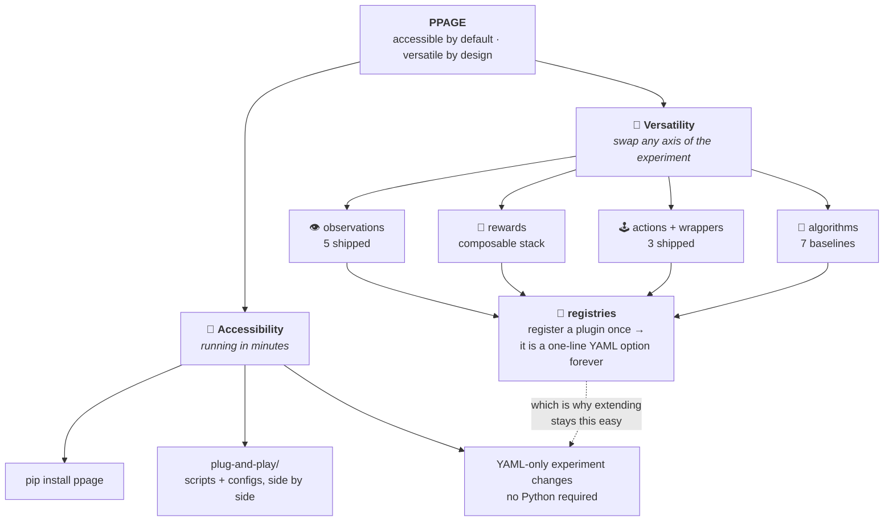

<p align="center">
  <picture>
    <source media="(prefers-color-scheme: dark)" srcset="https://raw.githubusercontent.com/UHUMALAB/PPAGE/main/miscellenous/imgs/title-dark.png?v=2">
    
  </picture>
</p>

<p align="center">
  <a href="https://doi.org/10.5281/zenodo.21833286"></a>
  <a href="https://pypi.org/project/ppage/"></a>
  
  <a href="https://uhumalab.github.io/PPAGE/"></a>
  <a href="https://github.com/UHUMALAB/PPAGE/actions/workflows/ci.yaml"></a>
  <a href="https://github.com/pre-commit/pre-commit"></a>
  <a href="https://github.com/psf/black"></a>
  
</p>

<p align="center">
  
</p>

<p align="center"><sub>A <b>trained</b> DQN predator (speed 2) running down a speed-1 prey around obstacles until capture, from the ready-made <code>plug-and-play/configs/dqn_1v1</code> experiment.</sub></p>

<p align="center">
A <b>deterministic, modular, research-grade multi-agent predator–prey environment</b> for studying coordination, pursuit–evasion, and emergent behavior in Multi-Agent Reinforcement Learning. It is not just a simulation, it is a controlled experimental laboratory: fully inspectable dynamics, pluggable perception and incentives, and reproducibility enforced by construction rather than assumed.
</p>

---

## 🎬 Showcase: four scenarios, one unchanged core

<table>
  <tr>
    <td width="50%" align="center">
      
      <br><sub><b>1 predator vs 1 prey</b> · 10&times;10<br>the hero's 1v1 roster, untrained and at speed 1</sub>
    </td>
    <td width="50%" align="center">
      
      <br><sub><b>2 predators vs 2 prey at double speed</b> · 10&times;10<br>speed/stamina via <code>SpeedWrapper</code></sub>
    </td>
  </tr>
  <tr>
    <td width="50%" align="center">
      
      <br><sub><b>Two predator teams vs 10 prey</b> · 50&times;50<br>cardinal movement (red) vs diagonal movement (pink)</sub>
    </td>
    <td width="50%" align="center">
      
      <br><sub><b>5 predators vs 20 prey</b> · 100&times;100<br>1,000 obstacles</sub>
    </td>
  </tr>
</table>

The clip above shows a *trained* policy on one configuration; these four show
the range of configurations themselves, all under **untrained, uniformly
random actions**. Read the first tile against the hero above and the difference
between learned pursuit and random motion is the whole point of the testbed.
Each clip runs a few short episodes: an episode ends at the first capture, then
the next begins with a fresh layout. Grid size, populations, obstacle density,
and per-agent speed are all YAML keys, so the same unmodified core produces
every one of these.
Colours and shapes are the environment's own (predators on the red hue, prey on
green, shade and shape separating subteams). Regenerate them with
`python .github/scripts/make_showcase_gifs.py`.

> One caveat on the third clip: the two movement geometries are the shipped
> `discrete_5` and `cross` action spaces, but assigning a *different* one per
> team is composed in the generator script rather than selected from YAML. The
> core holds a single global action space, and per-team assignment is not yet
> configurable from YAML.

---

## ❓ Why PPAGE

Most MARL environments mix environment logic with learning code, hide
important transition mechanics, and make reproducibility fragile, so
experimentation happens by hacking internals. PPAGE enforces something
stricter:

```text
Environment dynamics → Perception → Incentives → Learning
```

Each layer is isolated by construction:

* **Environment dynamics** defines what can happen (immutable core)
* **Perception** defines what agents know (observation plug-ins)
* **Incentives** define what agents optimize (reward plug-ins)
* **Learning** defines how they adapt (algorithm baselines)

Because the layers only meet through narrow interfaces, each one can be
studied, and swapped, independently. An experiment is fully determined by its
YAML configuration and a random seed: identical configuration yields an
identical trajectory, and this is verified by a dedicated determinism test
rather than merely documented.

The goal is not realism. The goal is **clarity, modularity, and scientific
control**, making MARL mechanistically understandable rather than opaque.

---

## ⚡ Quickstart

### Option 1: install from PyPI (library use)

Use the environment and baseline algorithms from your own code:

```bash
pip install ppage               # environment + tabular baselines (IQL, CQL, Mixed)
pip install "ppage[baselines]"  # adds PyTorch for DQN, ActorCritic, A2C, A3C
```

```python
from ppage.core.agent import Agent
from ppage.core.gridworld import GridWorldEnv

env = GridWorldEnv(
    agents=[
        Agent(agent_type="predator", agent_team="predator_1", agent_name="pred_1"),
        Agent(agent_type="prey", agent_team="prey_1", agent_name="prey_1"),
    ],
    size=8,
    seed=42,
)
result = env.reset()
```

### Option 2: clone the repository (ready-made experiments)

The YAML-driven experiment runners live in [`plug-and-play/`](https://github.com/UHUMALAB/PPAGE/tree/main/plug-and-play/),
which ships with the repository, not the pip package. The package uses a
standard `src/` layout, so an editable install makes `ppage` importable
without setting `PYTHONPATH`.

```bash
git clone https://github.com/UHUMALAB/PPAGE.git
cd PPAGE

python -m venv .venv
source .venv/bin/activate        # Windows: .venv\Scripts\Activate.ps1

pip install -e ".[baselines]"   # plain `pip install -e .` skips the PyTorch baselines

# Run the default experiment (3 predators vs 3 prey, IQL, plug-and-play/configs/experiment.yaml)
python plug-and-play/scripts/run_from_config.py

# Or one of the ready-made DQN experiments
python plug-and-play/scripts/run_dqn.py --config-dir plug-and-play/configs/dqn_1v1
```

All experiments are launched from the repository root. For a five-minute
walkthrough, see [`QUICKSTART.md`](https://github.com/UHUMALAB/PPAGE/blob/main/QUICKSTART.md); for the full guided version,
the [docs quickstart](https://uhumalab.github.io/PPAGE/guides/quickstart/).

### Running the tests

```bash
pip install -e ".[dev,baselines]"
python -m pytest tests/ -q
```

CI (`.github/workflows/ci.yaml`) runs this suite on Python 3.10/3.11/3.12 for
every push and PR to `main`/`master`/`STRP`, and a `core-guard` job fails any
PR that touches `core/` (see [For Contributors and Students](#-for-contributors-and-students)).
The Black/flake8/pylint lint job is currently disabled in CI; run them locally
via pre-commit.

---

## 🧭 Design Philosophy: Accessible by Default, Versatile by Design

PPAGE deliberately balances two properties that usually trade off against
each other:

* **Accessibility** — a first experiment should cost minutes, not days.
  `pip install ppage`, one [`plug-and-play/`](https://github.com/UHUMALAB/PPAGE/tree/main/plug-and-play/) folder where
  runnable scripts sit next to the YAML configs they consume, and experiment
  changes that never require touching Python.
* **Versatility** — every scientific axis of the experiment is swappable.
  What agents perceive (observations), what they optimize (rewards), what
  their actions mean (action spaces), and how they learn (algorithms) are
  each an independent plugin behind a registry.

The bridge between the two pillars is the **registry pattern**: a plugin
registered once becomes a one-line YAML option forever. Extending the system
is exactly as accessible as using it.



Concretely, each axis ships with reference implementations and stays open
for yours:

| Axis | Shipped | Examples of what you could add |
| --- | --- | --- |
| Observations | `default`, `local_only`, `local_radius`, `absolute`, `relative` | noisy sensors, field-of-view cones, line-of-sight occlusion, frame-stacking memory, CNN-ready grid patches |
| Rewards | `base`, `predator_distance`, `survival` (composable) | shared-credit capture splits, encirclement shaping, energy costs tied to stamina, time-decayed bonuses |
| Actions | `discrete_5`, `cross`, `speed_discrete_5` (+ `SpeedWrapper`) | king moves, momentum actions, wait-and-observe, macro-actions |
| Algorithms | IQL, CQL, MixedTrainer, DQN, ActorCritic, A2C, A3C | game-theoretic learners (JAL-GT/minimax-Q, WoLF-PHC, fictitious play), CTDE methods (VDN, QMIX) |

Each row has a written contract (`docs/specs/`); the observation, reward, and
action rows also have a step-by-step guide (`docs/guides/`); see [Design Philosophy](https://uhumalab.github.io/PPAGE/overview/design-philosophy/)
in the docs for the full extension menu with difficulty ratings.

For the configuration range this buys you (grid size, populations, obstacle
count, per-agent speed, and movement geometry), see the
[Showcase](#-showcase-four-scenarios-one-unchanged-core) at the top of this
README.

---

## 🏗 Architecture: Two Components

### 1️⃣ `ppage`: The Environment

Defines the world:

* Grid dynamics, agent movement, capture logic, episode termination (`core/`, immutable)
* Observation plug-ins: perception (`observations/`)
* Reward plug-ins: incentives (`rewards/`)
* Action-space plug-ins: what an agent's action integers mean (`actions/`)
* Wrappers: cross-cutting mechanics layered on top of the base env, e.g. per-agent speed/stamina (`wrappers/`, applied last in the build chain)
* Registries: the only sanctioned way to wire a plug-in into an experiment (`registry/`)

The shipped implementations for each plug-in category are listed in the
[Design Philosophy](#-design-philosophy-accessible-by-default-versatile-by-design)
table above.

### 2️⃣ `ppage.baselines`: The Learning Algorithms

* **IQL**: Independent Q-Learning (tabular)
* **CQL**: Centralized Q-Learning (tabular)
* **MixedTrainer**: per-team algorithm assignment (e.g. CQL predators vs IQL prey)
* **DQN**: Deep Q-Network (PyTorch, generic observation encoder, replay buffer, Double/Dueling variants)
* **ActorCritic**: one-step online actor-critic (PyTorch, policy-gradient)
* **A2C**: n-step advantage actor-critic (PyTorch)
* **A3C**: asynchronous A2C across worker processes (PyTorch, Hogwild)

See [`src/ppage/baselines/README.md`](https://github.com/UHUMALAB/PPAGE/blob/main/src/ppage/baselines/README.md) for the
algorithm contract and when to use each one.

Algorithms interact with the environment only through:

```python
env.reset()
env.step(actions)
```

They never access internal state directly. This guarantees structural
integrity: swapping what an agent perceives, optimizes, or does never
requires touching how it learns, and vice versa.

---

## 📂 Repository Structure

```
src/
└── ppage/                    # Environment (the installable library)
    ├── core/                 # Immutable environment dynamics (maintainers only)
    ├── observations/         # Perception plug-ins
    ├── rewards/              # Incentive plug-ins
    ├── actions/              # Action-space plug-ins
    ├── wrappers/             # Cross-cutting mechanics (e.g. SpeedWrapper)
    ├── registry/             # Safe plug-in selection
    └── baselines/            # Learning algorithms
        ├── IQL/  CQL/  MIXED/  DQN/  AC/  A2C/  A3C/
        └── registry/         # Algorithm name -> class

plug-and-play/                # Start here: runnable entry points
├── scripts/                  # Experiment runners (run_from_config, run_dqn, ...)
└── configs/                  # YAML experiment definitions
    ├── env.yaml, agents.yaml, observations.yaml, rewards.yaml, actions.yaml
    ├── experiment_{iql,cql,mixed,dqn,actor_critic,a2c,a3c}.yaml
    ├── dqn_1v1/, dqn_speed{1,2,3}/, d3qn/    # ready-made experiment sets
    └── demo_plus/, demo_diagonal/, demo_speed/   # movement demos

tests/                        # pytest suite: registries, plugin contracts,
                               # end-to-end training, architecture rules
```

Core environment dynamics is stable infrastructure. Observations, rewards,
actions, and algorithms are the intended extension points.

---

## 🧪 What You Can Study With This

* Emergent cooperation between predators
* Coordination failures
* Reward shaping effects
* Partial observability impact
* Centralized vs decentralized learning
* Constraint-induced coupling (speed, stamina)
* Credit assignment challenges

This environment is meant for MARL research, undergraduate research labs,
algorithm benchmarking, teaching reinforcement learning, and controlled
ablation experiments.

---

## 👩‍🎓 For Contributors and Students

You are encouraged to:

* Implement new reward functions
* Design new observation schemes
* Design new action spaces or wrappers
* Add new learning baselines
* Run structured experiments and reproducible ablations

You are not expected to modify core environment dynamics; this is enforced
automatically: a CI check fails any pull request that touches
`src/ppage/core/`. See [`CONTRIBUTING.md`](https://github.com/UHUMALAB/PPAGE/blob/main/CONTRIBUTING.md) for the full
contribution rules, and [`docs/git-workflow.md`](https://github.com/UHUMALAB/PPAGE/blob/main/docs/git-workflow.md) for
branching, commits, and how to open a PR.

This mirrors how research infrastructure is structured in practice.

---

## 📜 Citation

This repository ships a machine-readable [`CITATION.cff`](https://github.com/UHUMALAB/PPAGE/blob/main/CITATION.cff); GitHub's
"Cite this repository" button uses it. BibTeX equivalent:

```bibtex
@software{ppage,
  author       = {Muhammad Ahmed Atif and Nehal Naeem Haji and Muhammad Affan and Areesha Kashif and Musab Kasbati and Afshad Yazdi Sidhwa},
  title        = {Predator-Prey Archetype Gridworld Environment},
  year         = {2026},
  version      = {0.9.2},
  doi          = {10.5281/zenodo.21833286},
  url          = {https://github.com/UHUMALAB/PPAGE},
  note         = {A deterministic modular testbed for Multi-Agent Reinforcement Learning}
}
```

---

## ⚖️ License

[Apache License 2.0](https://github.com/UHUMALAB/PPAGE/blob/main/LICENSE)
