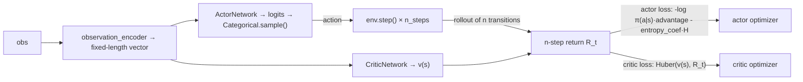

# A2C — Advantage Actor-Critic

**A2C** is the batched sibling of [ActorCritic](actor-critic.md): same policy-gradient
idea — a stochastic policy (actor) plus a state-value baseline (critic) that reduces
gradient variance — but instead of updating after every single environment step, it
accumulates a short rollout (`n_steps`) and updates once from an n-step bootstrapped
return. Unlike ActorCritic's shared-trunk network, A2C uses **separate** actor and
critic networks per agent.

## Theory

Over an `n_steps` rollout, the n-step return for a transition is

$$
R_t = r_t + \gamma r_{t+1} + \dots + \gamma^{n-1} r_{t+n-1} + \gamma^n V(s_{t+n})
$$

bootstrapped from the critic's own estimate of the state the rollout stopped at
(zero if that state is a true terminal). The advantage $A_t = R_t - V(s_t)$ drives
the actor's gradient; the critic minimizes $(V(s_t) - R_t)^2$ (Huber in this
implementation, not raw MSE — see below). Batching several steps before updating
gives a lower-variance gradient estimate than ActorCritic's single-step version, at
the cost of a small lag between experience and learning from it.

## How it works here



**Implementation:** `src/baselines/A2C/`.

- `a2c.py` — the `A2C` algorithm: per-agent `actors`, `critics`, separate
  `actor_optimizers`/`critic_optimizers` (the critic typically wants to learn
  faster/more stably than the actor, hence independent learning rates);
  `select_actions` samples from the actor's `Categorical` distribution (or acts
  greedily when `greedy_eval` is set, e.g. during evaluation).
- `actor_network.py` / `critic_network.py` — separate MLPs (unlike ActorCritic's
  shared trunk).

Same preconditions as ActorCritic/DQN: requires `env.observation_encoder`, and
resolves `action_dim` from `env.action_space_plugin.n_actions` with the same
fail-fast mismatch check.

**Critic loss is Huber (`SmoothL1Loss`), not MSE** — this environment's rewards
accumulate into the thousands per episode, and plain squared error on targets that
large produces destabilizing gradients: critic loss originally exploded into the
hundreds of thousands under MSE (quarterly average ~262,000 → ~191,000 on the
diagnostic 1v1 config) before this was fixed; under Huber it stays bounded at
~140-160 for the same run.

## Configuration

```yaml
experiment:
  algorithm:
    name: a2c
    params:
      gamma: 0.99
      hidden_layers: [128, 128]
      actor_learning_rate: 0.0003
      critic_learning_rate: 0.001
      n_steps: 5
      entropy_coef: 0.05          # 0.01 wasn't enough to hold capture rate up on this env
      actor_weight_decay: 0.001   # resolves the entropy collapse -- see below
      value_loss_coef: 0.5
      grad_clip: 5.0
      seed: 42
      device: "cpu"
      curves_path: "training_curves_a2c.csv"
```

```bash
python -m multi_agent_package.scripts.run_a2c
```

## When to use A2C

- The same use case as ActorCritic — a directly-learned stochastic policy — but
  with lower-variance, batched updates instead of noisy per-step ones.
- As the natural stepping stone toward [A3C](a3c.md): A2C's n-step rollout and
  bootstrap logic is exactly what each A3C worker runs locally; A3C just adds
  multiple parallel workers updating a shared network asynchronously instead of
  one process updating its own.

## The entropy collapse, and how it's actually fixed

Raising `entropy_coef` alone measurably improves capture rate on this
environment but does **not** prevent the policy's entropy from collapsing
toward zero mid-training. A logit-magnitude diagnostic confirmed why: `max|logit|`
grows from ~3 (near-random init) to a peak average of ~19 (individual spikes of
42-64) over training — a logit spread that large makes the softmax over 99.9999%
certain of one action, indistinguishable from zero entropy. The growth isn't
monotonic either: it rises, partially resets around rare capture events (whose
large reward/advantage briefly re-broadens the policy), then rises again — the
dense per-step distance-shaping reward is what drives the sharpening between
those resets.

**`actor_weight_decay` (an L2 penalty on the actor's weights) fixes this
directly**, since it counters the weight/logit growth at its source rather than
fighting it indirectly through the entropy bonus. Measured on the diagnostic 1v1
config, 2000 episodes, quarterly averages:

| `actor_weight_decay` | Entropy Q1→Q4 | Capture rate Q1→Q4 |
|---|---|---|
| `0.0` | 0.17 → 0.0003 → 0.0 → 0.0 | 32% → 29% → 31% → 29% (flat) |
| `0.0001` | 0.24 → 0.09 → 0.004 → 0.006 (delays collapse ~2×, doesn't prevent it) | 31% → 29% → 30% → 33% (flat) |
| **`0.001` (shipped default)** | **0.16 → 0.72 → 0.89 → 0.67 (recovers, stabilizes)** | **28% → 44% → 69% → 74% (climbing)** |

At `0.001`, entropy recovers and stabilizes instead of collapsing, and —
critically — this shows up as real task performance, not just a healthier-looking
metric: capture rate climbs steadily instead of staying flat, confirmed by decile
(not just quarter-level noise) to hold in the 60-77% range for the back half of
training, with reward improving in lockstep. This is the first sustained
*improving* trend seen across AC, A2C, or A3C on this diagnostic config.

**Tested on [ActorCritic](actor-critic.md) and [A3C](a3c.md) (both reuse
ActorCritic's shared-trunk network) — this specific fix does not transfer.**
Scoping `actor_weight_decay` to just the policy head (its own optimizer param
group, leaving the shared trunk and value head undecayed) does *not* restore
entropy there: unlike A2C's gradual mid-training collapse, AC/A3C's predator
entropy collapses to ~0 within the first couple of episodes, in every
configuration tested including `actor_weight_decay=0.001` — too fast for any
L2 penalty on a downstream layer to intervene. The actual root cause on
AC/A3C's shared-trunk architecture turned out to be different from (and
upstream of) A2C's logit-magnitude growth: nothing bounds the shared trunk's
own output scale, and the critic's training forces it to grow without limit to
represent this environment's large-magnitude returns, saturating
`policy_head`'s logits as a side effect. The real fix there is
`normalize_returns` (a PopArt-style running normalizer on the critic's
regression target) — see [ActorCritic's
writeup](actor-critic.md#the-instant-collapse-root-cause-found-and-fixed) for
the full diagnostic trail and verification numbers.

## Papers

- Mnih et al. (2016), *Asynchronous Methods for Deep Reinforcement Learning* —
  introduces A3C and, as its synchronous simplification, A2C.

Full list: [Papers & Further Reading](../reference/papers.md).
