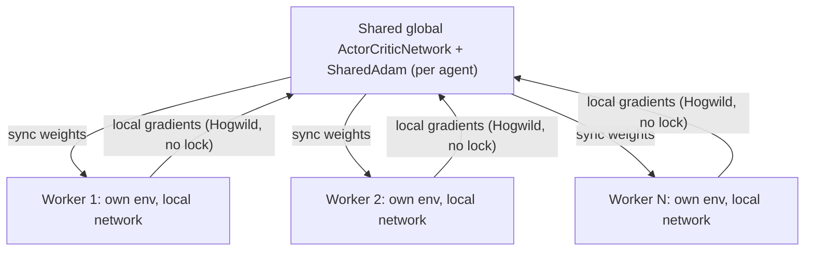

# A3C — Asynchronous Advantage Actor-Critic

**A3C** (Mnih et al., 2016) takes [A2C](a2c.md)'s idea — a stochastic policy plus a
value-baseline critic, updated from a short n-step rollout — and runs it across
**multiple worker processes in parallel**, each stepping its own independent copy of
the environment. Workers periodically sync a local copy of the network from a
**shared global network**, compute gradients locally, then apply those gradients
directly to the shared network and step a shared optimizer — lock-free
("Hogwild"-style asynchronous SGD), exactly as the original paper describes. There
is no replay buffer and no synchronization barrier between workers; the
decorrelated experience from many simultaneously-exploring workers is what
substitutes for one.

Architecturally it reuses [ActorCritic](actor-critic.md)'s `ActorCriticNetwork`
(shared trunk, policy head + value head) rather than A2C's separate actor/critic
networks — that's the architecture the original paper uses.

## Theory

Each worker collects an n-step rollout exactly like A2C (same bootstrapped return,
same advantage, same Huber critic loss), computed against its own **local** copy of
the network. The key difference is what happens next: instead of stepping its own
optimizer on its own weights, a worker copies its locally-computed gradients onto
the **shared global** parameters and steps a **shared** optimizer:

```python
for local_p, global_p in zip(local_network.parameters(), global_network.parameters()):
    global_p._grad = local_p.grad
optimizer.step()  # a SharedAdam instance, stepping the GLOBAL parameters
```

Multiple workers can (and will) interleave this without any lock. A worker might
compute gradients against slightly stale weights (another worker updated the global
network in between this worker's sync and its update) — this staleness is the
asynchronous part of A3C, and the paper's empirical finding is that it doesn't hurt
learning in practice; if anything the added noise acts like a mild regularizer.

## Why CPU, not GPU

A3C's entire premise is parallelism from many **CPU cores**, not a GPU. Safely
sharing one CUDA context across multiple OS processes needs CUDA IPC handles and
buys little for what A3C is designed around — GPU work benefits from batching,
which is what A2C already provides in a single process. Workers in this
implementation always run on CPU; `device` is not a configurable option for A3C.

## How it works here



**Implementation:** `src/baselines/A3C/`.

- `a3c.py` — the `A3C` algorithm class plus the module-level `_worker_loop`
  function that each spawned process runs. `A3C.__init__` builds one shared
  `ActorCriticNetwork` per agent (`.share_memory()`) and one `SharedAdam` per
  agent; `train()` spawns `num_workers` processes via `torch.multiprocessing`
  and joins them.
- `shared_adam.py` — `SharedAdam`: plain `torch.optim.Adam`'s per-parameter
  state (`exp_avg`, `exp_avg_sq`, step count) lives in *this process's* memory
  by default. Since every worker steps the same global parameters, that state
  has to live in shared memory too, or each process would silently keep its own
  diverging view of the Adam moment estimates.

### The `env_fn` requirement

`BaseAlgorithm.__init__(self, env, config)` normally receives one already-built
environment. A3C fundamentally needs one **independent** environment per worker
(that's where the decorrelated experience comes from) — so A3C requires one
additional config key beyond every other baseline: **`env_fn`**, a zero-argument
callable that builds a fresh environment. The `env` argument is still used the
normal way (inferring `state_dim`/`action_dim`/`agent_ids`, and for
`BaseAlgorithm.evaluate()`).

**`env_fn` must be picklable.** Worker processes are spawned via
`torch.multiprocessing`, which on Windows (and anywhere using the `'spawn'` start
method) pickles everything passed to `Process(args=...)`. A lambda closing over a
config dict will **not** survive that. `scripts/run_a3c.py` defines a small
`EnvFactory` class instead — a class instance holding only the plain, picklable
`configs` dict pickles correctly, where an equivalent lambda would raise
`AttributeError: Can't pickle local object`.

### Logging across processes

Multiple workers write to the same `curves_path` CSV concurrently, guarded by a
`multiprocessing.Lock` so writes don't interleave mid-row. Each row records which
`worker` produced it. **Episode numbers are not written in file order** — workers
run genuinely asynchronously, so a faster worker can log episode 8 before a slower
worker logs episode 5. Sort by the `episode` column before any quarter/decile-style
analysis; don't rely on row position.

## Configuration

```yaml
experiment:
  algorithm:
    name: a3c
    params:
      gamma: 0.99
      episodes: 1000
      learning_rate: 0.001
      hidden_layers: [128, 128]
      num_workers: 4
      n_steps: 5
      entropy_coef: 0.05
      value_coef: 0.5
      actor_weight_decay: 0.001  # L2 penalty on policy_head only (own optimizer
      # param group -- trunk/value_head shared with the critic stay undecayed);
      # doesn't restore entropy here (see "actor_weight_decay: shared-trunk
      # caveat" below) but measurably raises capture rate anyway
      normalize_returns: true  # the real fix for the entropy collapse -- see
      # "The instant collapse: same fix, with one open wrinkle" below.
      # return_norm_decay=0.999 is verified-safe; DO NOT lower it (0.99 causes
      # an outright numerical overflow, see below for why)
      return_norm_decay: 0.999
      grad_clip: 5.0
      seed: 42
      curves_path: "training_curves_a3c.csv"
```

```bash
python -m multi_agent_package.scripts.run_a3c
```

## Verification run

Built with both lessons already learned from [ActorCritic](actor-critic.md) and
[A2C](a2c.md) from day one — Huber critic loss, `entropy_coef=0.05` — rather than
rediscovering them. Ran `configs/dqn_1v1/experiment_a3c.yaml` (2000 episodes, 4
workers), the same diagnostic config AC/A2C already have data on:

| | Critic loss (bounded?) | Capture rate Q1→Q4 |
|---|---|---|
| AC (`entropy_coef=0.01`, fixed) | ~150–220, stable | 35.6% → 35.6% |
| A2C (`entropy_coef=0.05`) | ~140–160, stable | 32.2% → 28.8% |
| **A3C** (`entropy_coef=0.05`) | **~50–78, stable** | **32.8% → 25.2%** |

**Critic loss stayed bounded from the very first run** — it never explored the
hundreds-of-thousands range AC/A2C originally hit, because Huber loss was built
in from the start instead of discovered as a fix after the fact. **Capture rate
lands in the same range as A2C at the same `entropy_coef`** — comparable
performance to an already-tuned baseline, achieved with zero debugging cycles.

**Worker load was reasonably balanced** across the 4 processes (516/512/497/475
episodes) — no worker starving or dominating, a real risk with lock-free async
scheduling that didn't materialize here.

The mild decline in capture rate across quarters is similar in magnitude to
A2C's at the same entropy setting — not the sharp near-zero collapse
`entropy_coef=0.01` produces elsewhere (see [A2C's entropy-collapse
writeup](a2c.md#the-entropy-collapse-and-how-its-actually-fixed)) — so nothing
alarming, but at the time this was written, not resolved either. That question
is addressed directly below.

## `actor_weight_decay`: shared-trunk caveat

A3C reuses [ActorCritic](actor-critic.md)'s `ActorCriticNetwork` (shared trunk,
not A2C's separate actor/critic networks), so [A2C's
`actor_weight_decay` fix](a2c.md#the-entropy-collapse-and-how-its-actually-fixed)
needed the same scoping treatment tried on ActorCritic first: a dedicated
optimizer param group covering only `policy_head`, leaving `trunk` and
`value_head` — shared with the critic across every worker — at
`weight_decay=0`.

Adding entropy tracking to the per-worker CSV (previously untracked) to check
this directly turned up the same finding [ActorCritic's own
verification](actor-critic.md#actor_weight_decay-doesnt-fix-the-collapse-here-but-still-helps)
did: **predator entropy collapses to ~0 within the first couple of episodes,
in both the baseline and `actor_weight_decay=0.001` runs alike** — far too fast
for a downstream L2 penalty to intervene, unlike A2C's slower mid-training
collapse. Re-running `configs/dqn_1v1/experiment_a3c.yaml` end to end (2000
episodes, 4 workers) at both settings:

| `actor_weight_decay` | Capture rate Q1→Q4 | Overall |
|---|---|---|
| `0.0` (baseline) | 33.6% → 26.4% → 22.8% → 20.8% | 25.9% |
| **`0.001`** | **36.0% → 35.4% → 31.2% → 29.4%** | **33.0%** |

Entropy stays flat at ~0 in both, but `0.001` is consistently higher throughout
and its decline across quarters is milder — directionally the same story as
ActorCritic's: not a restored-exploration effect (entropy never recovers), but
a real capture-rate improvement anyway, most likely from the smaller policy-head
weight magnitudes yielding a better-calibrated argmax choice under noisy
per-step TD targets. Given the consistent benefit, `actor_weight_decay: 0.001`
is now the shipped default here too.

**One artifact worth flagging honestly:** the `0.001` run's logged combined loss
(actor + critic terms) spiked to ~285,000 at one episode (vs. the bounded ~50–78
range reported above), traced to a short run of episodes (around #1370–1434)
where a very short, near-instant-capture episode combined with the
by-then-fully-collapsed policy produced a large `log_prob × advantage` product
in the logged actor loss. `torch.nn.utils.clip_grad_norm_` still bounds the
*actual* gradient step applied to the shared network regardless of this raw
loss value, so training itself wasn't destabilized — this is a logging artifact
of rare-event sampling under a collapsed policy, not a new instability — but
it's a real deviation from "critic loss stays bounded" as stated above, worth
knowing about rather than smoothing over.

## The instant collapse: same fix, with one open wrinkle

Full diagnostic trail is on [ActorCritic's writeup](actor-critic.md#the-instant-collapse-root-cause-found-and-fixed)
— A3C reuses the same `ActorCriticNetwork`, hits the identical instant
(within a couple of episodes) collapse, and the same root cause applies: the
shared trunk's output scale is unbounded, and the critic's own training
forces it to grow without limit to represent this environment's
large-magnitude returns, saturating `policy_head`'s logits as a side effect
of the critic doing its job. `grad_clip` and TD-error-magnitude normalization
were dead ends on ActorCritic for the same reasons they'd be here (Adam
absorbs the former; the latter fights the wrong problem — see the linked
writeup).

**`normalize_returns` fixes this here too, and the improvement is even
larger than ActorCritic's.** Each worker keeps its own *local* running
normalizer (`RunningReturnNormalizer`, plain `update()` — not the
weight-rescaling PopArt variant; see below for why). Verified end-to-end on
`configs/dqn_1v1` (2000 episodes, 4 workers, `return_norm_decay=0.999`):

| | Entropy Q1→Q4 | Capture rate Q1→Q4 | Overall |
|---|---|---|---|
| Baseline (no fix) | 0.03 → 0.0 → 0.0 → 0.0 | 33.6% → 26.4% → 22.8% → 20.8% | 25.9% |
| `actor_weight_decay=0.001` (workaround) | 0.05 → 0.0 → 0.0 → 0.0 | 36.0% → 35.4% → 31.2% → 29.4% | 33.0% |
| **`normalize_returns=True` (fix)** | **1.53 → 1.48 → 1.25 → 1.03** | **81.0% → 87.6% → 94.8% → 78.4%** | **85.5%** |

Capture rate more than triples the baseline, exceeding even ActorCritic's own
75.1% and landing above DQN's 80.3% on this identical config — the best
result any baseline has produced here.

**The open wrinkle: a real, sharp late-training partial re-collapse, shared
across all 4 workers.** Breaking the last 300 episodes into 30-episode
chunks: entropy holds around 0.9-1.3 through roughly episode 1880, then drops
to 0.24-0.55 in the final ~120 episodes, with capture rate falling in lockstep
(73-97% → 23-40%). Checked whether this was one unlucky worker (a local
normalizer randomly drifting) versus a shared phenomenon: all 4 workers show
matching decline (mean entropy 0.32-0.43 apiece in the last 100 episodes) — a
real, reproducible dynamic, not noise from one process.

**Why ActorCritic's full PopArt fix (weight-rescaling `value_head` to
"preserve outputs precisely" across each normalizer update — see
ActorCritic's own writeup) isn't a drop-in fix here.** That rescale is only
well-defined against *one* consistent running estimate. A3C's workers each
keep independent local estimates over the *same shared* `value_head` — four
uncoordinated rescales of one shared layer, computed against four different
(mean, std) estimates and applied asynchronously under Hogwild, would fight
each other rather than stabilize anything. A properly shared, lock-protected
normalizer (mirroring how `SharedAdam`'s per-parameter state already lives in
shared memory) would let the same PopArt rescale apply consistently — a real
path forward, not attempted here given the added per-step lock-contention
cost to a currently lock-free design.

**A concrete warning, not just a theoretical one: faster `return_norm_decay`
does not fix the wrinkle, it causes outright numerical divergence.**
Tried `return_norm_decay=0.99` (10x faster-adapting than the default `0.999`)
on the theory that a shorter memory window would track a shifting return
distribution more responsively. Instead, all 4 workers crashed with a raw
`OverflowError` (`raw_value ** 2` exceeding float range) partway through
training. Mechanism: without the weight-rescale, `value_head`'s weights only
move via slow gradient steps, so if the running scale shifts meaningfully
between updates, the same weights get reinterpreted against a different
target each time — usually a mild, self-correcting drift (which is plausibly
what causes the late-training wrinkle at the safe `decay=0.999` too, just
mild enough not to diverge outright), but a fast enough decay lets it compound
into runaway divergence. **`return_norm_decay=0.999` is the verified-safe
setting and the shipped default; do not lower it without also building the
shared-normalizer + weight-rescale fix above.**

**Status:** `normalize_returns=True` (`return_norm_decay=0.999`) is now the
shipped default — a huge, verified improvement over both the baseline and the
`actor_weight_decay` workaround, with one honestly-documented late-training
wrinkle left as an open problem (shared, lock-protected normalizer + PopArt
rescale is the concrete next step, not a mystery to re-diagnose from scratch).

## When to use A3C

Study asynchronous, multi-worker training dynamics specifically. On a small
gridworld like this one, A3C won't necessarily out-train A2C wall-clock-for-wall
-clock — the interesting thing A3C offers is decorrelated, lock-free parallel
exploration, not raw speed.

## Papers

- Mnih et al. (2016), *Asynchronous Methods for Deep Reinforcement Learning* — A3C
  and the synchronous A2C simplification.
- Sutton & Barto (2018), *Reinforcement Learning: An Introduction*, 2nd ed.,
  Chapter 13 — the actor-critic derivation both ActorCritic and A2C/A3C build on.

Full list: [Papers & Further Reading](../reference/papers.md).
