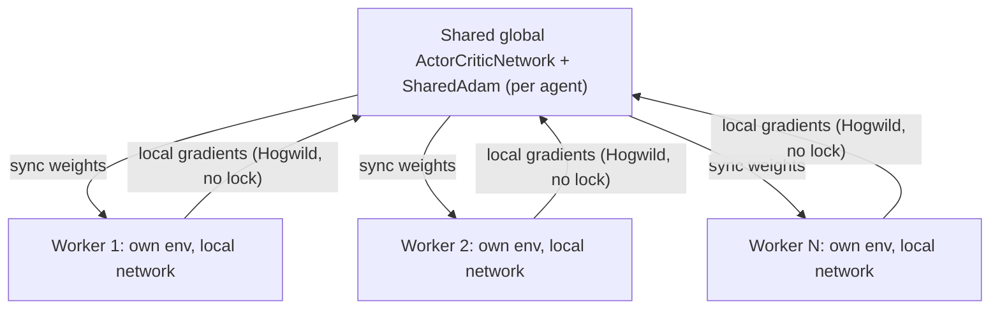

# A3C — Asynchronous Advantage Actor-Critic

**A3C** (Mnih et al., 2016) takes [A2C](a2c.md)'s idea — a stochastic policy plus a
value-baseline critic, updated from a short n-step rollout — and runs it across
**multiple worker processes in parallel**, each stepping its own independent copy of
the environment. Workers periodically sync a local copy of the network from a
**shared global network**, compute gradients locally, then apply those gradients
directly to the shared network and step a shared optimizer — lock-free
("Hogwild"-style asynchronous SGD), exactly as the original paper describes. There
is no replay buffer and no synchronization barrier between workers; the
decorrelated experience from many simultaneously-exploring workers is what
substitutes for one.

Architecturally it reuses [ActorCritic](actor-critic.md)'s `ActorCriticNetwork`
(shared trunk, policy head + value head) rather than A2C's separate actor/critic
networks — that's the architecture the original paper uses.

## Theory

Each worker collects an n-step rollout exactly like A2C (same bootstrapped return,
same advantage, same Huber critic loss), computed against its own **local** copy of
the network. The key difference is what happens next: instead of stepping its own
optimizer on its own weights, a worker copies its locally-computed gradients onto
the **shared global** parameters and steps a **shared** optimizer:

```python
for local_p, global_p in zip(local_network.parameters(), global_network.parameters()):
    global_p._grad = local_p.grad
optimizer.step()  # a SharedAdam instance, stepping the GLOBAL parameters
```

Multiple workers can (and will) interleave this without any lock. A worker might
compute gradients against slightly stale weights (another worker updated the global
network in between this worker's sync and its update) — this staleness is the
asynchronous part of A3C, and the paper's empirical finding is that it doesn't hurt
learning in practice; if anything the added noise acts like a mild regularizer.

## Why CPU, not GPU

A3C's entire premise is parallelism from many **CPU cores**, not a GPU. Safely
sharing one CUDA context across multiple OS processes needs CUDA IPC handles and
buys little for what A3C is designed around — GPU work benefits from batching,
which is what A2C already provides in a single process. Workers in this
implementation always run on CPU; `device` is not a configurable option for A3C.

## How it works here



**Implementation:** `src/baselines/A3C/`.

- `a3c.py` — the `A3C` algorithm class plus the module-level `_worker_loop`
  function that each spawned process runs. `A3C.__init__` builds one shared
  `ActorCriticNetwork` per agent (`.share_memory()`) and one `SharedAdam` per
  agent; `train()` spawns `num_workers` processes via `torch.multiprocessing`
  and joins them.
- `shared_adam.py` — `SharedAdam`: plain `torch.optim.Adam`'s per-parameter
  state (`exp_avg`, `exp_avg_sq`, step count) lives in *this process's* memory
  by default. Since every worker steps the same global parameters, that state
  has to live in shared memory too, or each process would silently keep its own
  diverging view of the Adam moment estimates.

### The `env_fn` requirement

`BaseAlgorithm.__init__(self, env, config)` normally receives one already-built
environment. A3C fundamentally needs one **independent** environment per worker
(that's where the decorrelated experience comes from) — so A3C requires one
additional config key beyond every other baseline: **`env_fn`**, a zero-argument
callable that builds a fresh environment. The `env` argument is still used the
normal way (inferring `state_dim`/`action_dim`/`agent_ids`, and for
`BaseAlgorithm.evaluate()`).

**`env_fn` must be picklable.** Worker processes are spawned via
`torch.multiprocessing`, which on Windows (and anywhere using the `'spawn'` start
method) pickles everything passed to `Process(args=...)`. A lambda closing over a
config dict will **not** survive that. `scripts/run_a3c.py` defines a small
`EnvFactory` class instead — a class instance holding only the plain, picklable
`configs` dict pickles correctly, where an equivalent lambda would raise
`AttributeError: Can't pickle local object`.

### Logging across processes

Multiple workers write to the same `curves_path` CSV concurrently, guarded by a
`multiprocessing.Lock` so writes don't interleave mid-row. Each row records which
`worker` produced it. **Episode numbers are not written in file order** — workers
run genuinely asynchronously, so a faster worker can log episode 8 before a slower
worker logs episode 5. Sort by the `episode` column before any quarter/decile-style
analysis; don't rely on row position.

## Configuration

```yaml
experiment:
  algorithm:
    name: a3c
    params:
      gamma: 0.99
      episodes: 1000
      learning_rate: 0.001
      hidden_layers: [128, 128]
      num_workers: 4
      n_steps: 5
      entropy_coef: 0.05
      value_coef: 0.5
      grad_clip: 5.0
      seed: 42
      curves_path: "training_curves_a3c.csv"
```

```bash
python -m multi_agent_package.scripts.run_a3c
```

## When to use A3C

Study asynchronous, multi-worker training dynamics specifically. On a small
gridworld like this one, A3C won't necessarily out-train A2C wall-clock-for-wall
-clock — the interesting thing A3C offers is decorrelated, lock-free parallel
exploration, not raw speed.

## Papers

- Mnih et al. (2016), *Asynchronous Methods for Deep Reinforcement Learning* — A3C
  and the synchronous A2C simplification.
- Sutton & Barto (2018), *Reinforcement Learning: An Introduction*, 2nd ed.,
  Chapter 13 — the actor-critic derivation both ActorCritic and A2C/A3C build on.

Full list: [Papers & Further Reading](../reference/papers.md).
