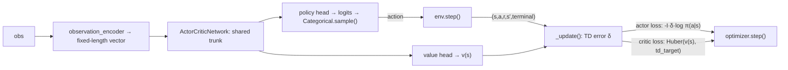

# ActorCritic — One-Step Online Actor-Critic

**ActorCritic** is this project's first **policy-gradient** baseline: instead of
learning Q-values and acting greedily (like [IQL](iql.md), [CQL](cql-mixed.md), and
[DQN](dqn.md) all do), it learns a stochastic policy $\pi_\theta(a \mid s)$ directly,
alongside a state-value critic $v_w(s)$ used only to reduce the policy gradient's
variance. It is **independent per agent**, mirroring DQN's structure: one network
and one optimizer each, with no shared value function between agents.

This is the *vanilla* actor-critic — Sutton & Barto's Algorithm 13.5, "Actor-Critic
(episodic), for estimating $\pi_\theta$" — not the batched A2C or asynchronous A3C
variants. See [Algorithms Overview → Roadmap](index.md#roadmap) for where those fit.

## Theory

At every step the critic computes a one-step TD error:

$$
\delta = r + \gamma\, (1 - \text{terminal})\, v_w(s') - v_w(s)
$$

which serves two purposes at once:

- **Critic update** — move $v_w(s)$ toward the TD target by minimizing a loss on
  $\delta$ (Huber, not raw $\delta^2$ — see below).
- **Actor update** — treat $\delta$ as an estimate of the advantage of the action
  actually taken, and push $\pi_\theta$ toward actions with positive $\delta$:

$$
\theta \leftarrow \theta + \alpha_\theta \, I \, \delta \, \nabla_\theta \ln \pi_\theta(a \mid s)
$$

$I$ starts at $1$ each episode and decays by $I \leftarrow \gamma I$ every step — it
downweights the actor's gradient for states reached later in the episode, which is
what makes this the correct on-policy gradient estimator rather than an ad-hoc
weighting.

Two things this algorithm deliberately **does not** have, unlike DQN:

- **No replay buffer** — on-policy learning requires each update to come from the
  current policy, not a mix of old and new behavior.
- **No target network** — the critic bootstraps off its own live value estimate;
  there is no separate slow-moving copy to stabilize against.

## How it works here



**Implementation:** `src/baselines/AC/`.

- `actor_critic.py` — the `ActorCritic` algorithm: per-agent `networks`,
  `optimizers`; `select_actions` samples from `Categorical(logits=...)` (the
  stochastic policy *is* the exploration — no epsilon schedule); `_update` computes
  the TD error, actor loss, and critic loss and takes one optimizer step per
  transition, immediately, every env step.
- `network.py` — `ActorCriticNetwork`: a shared MLP trunk feeding a policy head
  (per-action logits) and a value head (scalar), the same trunk-then-heads shape as
  `DuelingQNetwork`, repurposed for policy-gradient learning.

Like DQN, `ActorCritic` requires a **numeric** observation via
`env.observation_encoder`, and distinguishes true termination from timeout
truncation so the critic keeps bootstrapping through time-limit cut-offs (`_update`'s
`terminal` argument) — see [Training Loop](../flows/training-loop.md).

## Configuration

```yaml
experiment:
  algorithm:
    name: actor_critic
    params:
      hidden_layers: [128, 128]
      learning_rate: 0.001
      gamma: 0.99
      value_coef: 0.5     # weight on the critic's Huber loss in the combined loss
      entropy_coef: 0.01  # weight on the policy entropy bonus -- 0.0 let capture rate
      # collapse toward 0 over training; see "Fixes found through verification runs" below
      actor_weight_decay: 0.001  # L2 penalty on policy_head only (own optimizer param
      # group -- trunk/value_head stay undecayed); doesn't restore entropy here (see
      # "actor_weight_decay doesn't fix the collapse here, but still helps" below) but
      # measurably raises capture rate (~25% -> ~35%) anyway
      grad_clip: 5.0
      seed: 42
      device: "cpu"
      curves_path: "training_curves_actor_critic.csv"   # optional
```

```bash
python -m multi_agent_package.scripts.run_actor_critic
```

## Fixes found through verification runs

Passing unit tests confirmed the algorithm *executes* correctly; they didn't catch
either of the following, which only showed up in real training runs.

**Critic loss originally used plain squared error, not Huber.** On the shared
3-predator-vs-3-prey config (10x10 grid, 20% obstacles, predator speed 1 / prey
speed 3, 1000 episodes), predator critic loss sat at ~687,000 in Q1 and was still
~602,000 by Q4 — not shrinking, three orders of magnitude larger than DQN's loss
on comparable configs. Root cause: this environment's rewards accumulate into the
thousands per episode, and squared error on TD targets that large produces
gradients large enough to destabilize the shared trunk both heads depend on.
Switching to Huber (`SmoothL1Loss`) — the same fix DQN already uses — dropped
predator critic loss to ~211 → ~224 on the identical config, roughly a 3000x
reduction, confirming the diagnosis rather than run-to-run noise.

**`entropy_coef=0.0` let capture rate collapse toward zero.** Isolating the
question of "hard task vs. under-tuned algorithm" required a config with existing
DQN data to compare against directly: `configs/dqn_1v1` (1v1, predator speed 2 /
prey speed 1, 2000 episodes, matching DQN's own horizon on this config). With no
entropy bonus, capture rate declined steadily rather than staying flat:

| | Q1 | Q2 | Q3 | Q4 |
|---|:--:|:--:|:--:|:--:|
| Capture rate, `entropy_coef=0.0` | 6.4% | 5.6% | 3.4% | 0.6% |

Meanwhile critic loss dropped smoothly (20.4 → 0.33) — in isolation that looks like
convergence, but combined with the collapsing capture rate it's the signature of a
specific failure mode: the critic learns to predict a boring, predictable outcome
(timeout, no capture, steady shaping penalty) because the policy has stopped
attempting anything else. Low surprise = low loss, even as behavior gets worse.
Raising `entropy_coef` to `0.01` (the standard A2C/A3C default) on the identical
run fixed it:

| | Q1 | Q4 |
|---|:--:|:--:|
| Capture rate, `entropy_coef=0.0` | 6.4% | 0.6% (collapsing) |
| Capture rate, `entropy_coef=0.01` | 35.6% | 36.4% (stable) |

Confirmed by decile, not just quarter-level noise: `36.5%, 37%, 33.5%, 34.5%,
36.5%, 33.5%, 34%, 36%, 35%, 37.5%` — flat throughout, no late-training decay
anywhere in the run.

**One nuance, kept honest rather than smoothed over:** predator *reward* itself
stays deeply negative and roughly flat (~−3300 to −3450) even with the much
higher capture rate — the accumulated per-step distance-shaping penalty across
the ~65% of episodes that still end in timeout dominates the reward signal, so
"reward improving" and "actual task performance improving" are not the same story
here. Capture rate is the metric that actually reflects what changed; raw reward
does not. See [Algorithm Spec → MARL Constraints and Limitations](../specs/algorithm-spec.md#marl-constraints-and-limitations)
for this pattern confirmed across every baseline, not just ActorCritic.

Both fixes were validated cleanly on 1v1. Re-run on the harder 3v3 config, the
entropy fix is a wash on aggregate reward/critic-loss numbers, but raw log
analysis (counting capture events from episode length) shows captures occurring
steadily across all four quarters (~16-28%) rather than collapsing — so the fix
is *validated on 1v1, directionally consistent but not conclusively confirmed on
3v3*.

## `actor_weight_decay` doesn't fix the collapse here, but still helps

[A2C's entropy-collapse writeup](a2c.md#the-entropy-collapse-and-how-its-actually-fixed)
found that `actor_weight_decay` (L2 penalty on the actor's weights) restores
entropy and drives capture rate up. Testing the same idea on ActorCritic
required deciding what "the actor's weights" even means when the actor and
critic share one trunk: decaying the whole network would also regularize the
critic's value estimates, not just the policy. The scoped analog — a dedicated
optimizer param group covering only `policy_head`, with `trunk` and
`value_head` left at `weight_decay=0` — is what `actor_weight_decay` configures
here and on [A3C](a3c.md#actor_weight_decay-shared-trunk-caveat).

Enabling entropy tracking in the training CSV (previously untracked for this
baseline) to actually check the collapse directly turned up something the
original entropy_coef verification above never measured: **predator entropy
does not gradually collapse over training here the way it does in A2C — it
collapses almost instantly.** On `configs/dqn_1v1`, predator entropy starts near
1.06 at episode 1 and is already ~0.0 by episode 2, staying there for the
remaining 1998 episodes — in *every* configuration tested, including
`actor_weight_decay=0.001`. A2C's collapse takes hundreds of episodes to fully
develop, which is what gives its weight-decay fix room to act; here the
collapse is essentially complete before any regularizer — entropy bonus or L2
penalty alike — gets a chance to exert counter-pressure. Likely cause: the same
per-step TD-error gradient that shapes the critic's value estimate flows
through the shared trunk into the policy logits too, and this environment's
early TD errors are already large (predator rewards run into the thousands
against a near-zero initial value estimate), so the very first few gradient
steps can saturate the softmax outright.

Despite entropy staying flat at ~0 in both cases, `actor_weight_decay=0.001`
still produces a real, reproducible capture-rate improvement on the identical
2000-episode `configs/dqn_1v1` run:

| `actor_weight_decay` | Capture rate Q1→Q4 | Overall |
|---|---|---|
| `0.0` (baseline) | 28.6% → 22.2% → 24.4% → 25.4% | 25.1% |
| **`0.001`** | **35.8% → 34.8% → 34.8% → 34.6%** | **35.0%** |

Both trajectories are flat quarter-to-quarter (no late-training decay either
way), but decay is consistently ~10 percentage points higher throughout —
confirmed by decile, not just quarter-level noise. Since entropy itself never
recovers, this isn't "restored exploration" the way it is for A2C; the likelier
mechanism is that shrinking the policy head's weights keeps the (still
near-deterministic) logit gap smaller in magnitude, which plausibly yields a
better-calibrated argmax choice under this environment's noisy per-step TD
targets than the undamped version does. Given the clear, consistent benefit
with no observed downside, `actor_weight_decay: 0.001` is now the shipped
default.

## The instant collapse: root cause found and fixed

`actor_weight_decay` measurably helps capture rate but is a workaround, not a
fix — entropy itself never recovers. Chasing an actual fix required
instrumenting the update directly (same methodology as [A2C's logit-magnitude
diagnostic](a2c.md#the-entropy-collapse-and-how-its-actually-fixed)) rather
than guessing from the loss formula, and went through two dead ends before
landing on the real mechanism.

**Dead end 1: `grad_clip` is nearly powerless against Adam.** Logging the
pre-clip gradient norm on `policy_head` shows it sits at 30-100+ on *every*
step from the very first one — `grad_clip=5.0` isn't catching rare outliers,
it's engaging on effectively every single update. But sweeping `grad_clip`
from `5.0` down to `0.1` (a 50x reduction) barely changed the collapse timing
at all. Why: Adam re-normalizes each parameter's step by its own running RMS
gradient magnitude *after* clipping, so the actual applied step size stays
roughly proportional to `lr` regardless of how hard the raw gradient was
clipped beforehand. This is also *why* `actor_weight_decay` never had a real
chance: its per-step pull (`weight_decay × lr`) is orders of magnitude smaller
than a step Adam is already going to take at roughly full `lr` regardless. A
genuinely separate, much lower learning rate on `policy_head` (which
multiplies Adam's *output* step directly, bypassing its normalization) did
meaningfully slow the collapse, but only delayed it — entropy drifted back
toward zero over a longer horizon rather than stabilizing.

**Dead end 2: the reward signal's *sign* stays constant for long stretches,
not just its magnitude — but "fixing" that made things worse.** Logging raw,
untouched TD errors across an untrained rollout: `delta` was negative on 39 of
40 consecutive steps, flipping positive only on the one rare capture. The
actor's update (`-delta·log_prob`) *decreases* the sampled action's
probability whenever `delta` is negative — nearly always, early on — so
consecutive updates aren't yet "learning good actions," they're closer to
**symmetry-breaking by chance**: whichever action happens to get
*under*-sampled early is punished less often, so its probability snowballs
upward regardless of which action is actually good. The standard textbook fix
for a badly-scaled TD error — normalizing `delta` by a running estimate of its
own magnitude, applied only to the actor's gradient input — was tried and made
things **worse**: entropy hit ~0.0 by step 100 instead of ~300. Normalizing to
a consistent unit scale doesn't touch sign-correlation; it just makes every
step in a same-signed run push with similarly full force instead of
occasionally being small by chance.

**The actual root cause: nothing bounds the shared trunk's output scale, and
the critic's own training forces it to grow without limit.** Freezing the
actor completely (zero gradient into `policy_head`, only the critic training)
still collapsed entropy to 0.0 within ~70 steps. Logging the trunk's own
output feature norm during this critic-only run: it grows from ~3 to over
1000 in ~220 steps, tracking the value estimate's growing magnitude (this
env's per-episode returns run into the thousands) — while `policy_head`'s own
weight norm never changes at all (it has zero gradient). `policy_head` is a
plain linear readout on those same trunk features (`logits =
W_policy · trunk_features`), so as the trunk's feature norm explodes to fit
the critic's targets, the logits explode right along with it — saturating the
softmax as a pure side effect of the critic doing its job, independent of any
actor-specific dynamics. Normalizing the instantaneous *reward* wasn't enough
either: even an O(1) reward compounds to O(1 / (1 - gamma)) ≈ 100 in the
bootstrapped return with `gamma=0.99`, which is still large enough to force
the same growth.

**The fix: normalize the actual return target, not just the reward
(`normalize_returns`, `src/baselines/AC/return_normalizer.py`).** A
PopArt-style (van Hasselt et al., 2016) running mean/std normalizer tracks
the *bootstrapped return's own* scale and trains the critic to predict that
normalized (properly O(1)) quantity instead of the raw, unbounded one.
`RunningReturnNormalizer.stats()` returns a bias-corrected (mean, std)
estimate (same two-phase EMA pattern Adam itself uses for its moment
estimates) — called once *before* an update to un-normalize a bootstrap value
against the prior estimate, and once *after* to normalize the freshly
computed target against the updated one. With trunk feature norms kept small
(2-10 instead of 1000+), the sign-correlation dynamic from dead end 2 still
exists (it's intrinsic to a dense, smoothly-varying reward) but no longer has
a runaway, ever-growing representation to amplify through — it becomes
ordinary, bounded policy-gradient noise instead of instant saturation.

**A first version used plain `update()` and worked, but had a latent
stability gap** — confirmed the hard way on [A3C](a3c.md#the-instant-collapse-same-fix-with-one-open-wrinkle):
a faster-adapting `return_norm_decay` didn't track a shifting distribution
better as expected, it caused an outright numerical overflow. Mechanism:
`value_head`'s weights only move via slow gradient steps, so if the running
scale shifts meaningfully between updates, the same weights get
reinterpreted against a different target each time — a mild,
self-correcting drift normally, but one a fast decay can compound into
divergence. ActorCritic now uses the *full* PopArt technique instead:
`update_and_rescale_value_head()` advances the running stats **and**
analytically rescales `value_head`'s weight and bias so its *denormalized*
prediction is unchanged at the instant of the update (PopArt's "preserving
outputs precisely") — `w_new = w_old · (σ_old/σ_new)`,
`b_new = b_old · (σ_old/σ_new) + (μ_old - μ_new)/σ_new`. This decouples what
the network has already learned from a shifting normalization target, closing
the gap rather than just avoiding triggering it. Only well-defined against
one consistent running estimate, so it only applies to `ActorCritic`'s
single-network setup — A3C's per-worker independent estimates over one
*shared* `value_head` would need a synchronized normalizer first (see A3C's
own writeup).

Verified end-to-end on `configs/dqn_1v1` (2000 episodes, identical seed/setup
to every other run on this page):

| | Entropy Q1→Q4 | Capture rate Q1→Q4 | Overall |
|---|---|---|---|
| Baseline (no fix) | 0.0 → 0.0 → 0.0 → 0.0 | 28.6% → 22.2% → 24.4% → 25.4% | 25.1% |
| `actor_weight_decay=0.001` (workaround) | 0.0 → 0.0 → 0.0 → 0.0 | 35.8% → 34.8% → 34.8% → 34.6% | 35.0% |
| **`normalize_returns=True` (fix, with PopArt rescale)** | **1.25 → 1.30 → 1.16 → 1.12** | **51.8% → 81.4% → 84.6% → 82.6%** | **75.1%** |

Entropy holds well clear of zero for the entire run (a healthy 1.1-1.3 range,
vs. `ln(5) ≈ 1.609` being the theoretical max for 5 actions). Capture rate
triples the baseline and more than doubles the `actor_weight_decay`
workaround — confirmed by decile, not just quarter-level noise, climbing from
40.5% in the first decile to a stable 72-88% range for the remaining nine —
landing right next to DQN's own 80.3% on this identical config (see
[Algorithms Overview](index.md) for that comparison), a range no actor-critic
variant on this environment had reached before. `normalize_returns: true`
(with `return_norm_decay: 0.999`) is now the shipped default.

[A3C](a3c.md#the-instant-collapse-same-fix-with-one-open-wrinkle) reuses this
same network and the same underlying fix (plain `update()`, not the PopArt
rescale — see why in its own writeup), with one additional wrinkle specific
to its multi-worker setting.

## When to use ActorCritic

- You want a **directly-learned stochastic policy** rather than a greedy-over-Q one
  (useful when the optimal policy itself should be stochastic, or when you want
  smooth exploration without an epsilon schedule to tune).
- You want the **on-policy counterpart to DQN** for a comparative study — same
  environment, same per-agent independence, different learning paradigm.

For faster wall-clock convergence in this small gridworld, DQN's replay buffer
typically gets more mileage out of each transition; ActorCritic's appeal is
algorithmic (on-policy, no replay/target-network machinery) rather than sample
efficiency.

## Papers

- Sutton & Barto (2018), *Reinforcement Learning: An Introduction*, 2nd ed.,
  Chapter 13 — the actor-critic derivation and Algorithm 13.5 this implementation
  follows directly.
- Mnih et al. (2016), *Asynchronous Methods for Deep Reinforcement Learning* — A3C,
  and the synchronous A2C variant referenced in the [Roadmap](index.md#roadmap).

Full list: [Papers & Further Reading](../reference/papers.md).
