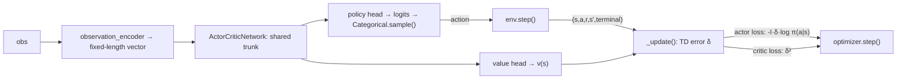

# ActorCritic — One-Step Online Actor-Critic

**ActorCritic** is this project's first **policy-gradient** baseline: instead of
learning Q-values and acting greedily (like [IQL](iql.md), [CQL](cql-mixed.md), and
[DQN](dqn.md) all do), it learns a stochastic policy $\pi_\theta(a \mid s)$ directly,
alongside a state-value critic $v_w(s)$ used only to reduce the policy gradient's
variance. It is **independent per agent**, mirroring DQN's structure: one network
and one optimizer each, with no shared value function between agents.

This is the *vanilla* actor-critic — Sutton & Barto's Algorithm 13.5, "Actor-Critic
(episodic), for estimating $\pi_\theta$" — not the batched A2C or asynchronous A3C
variants. See [Algorithms Overview → Roadmap](index.md#roadmap) for where those fit.

## Theory

At every step the critic computes a one-step TD error:

$$
\delta = r + \gamma\, (1 - \text{terminal})\, v_w(s') - v_w(s)
$$

which serves two purposes at once:

- **Critic update** — minimize $\delta^2$, moving $v_w(s)$ toward the TD target.
- **Actor update** — treat $\delta$ as an estimate of the advantage of the action
  actually taken, and push $\pi_\theta$ toward actions with positive $\delta$:

$$
\theta \leftarrow \theta + \alpha_\theta \, I \, \delta \, \nabla_\theta \ln \pi_\theta(a \mid s)
$$

$I$ starts at $1$ each episode and decays by $I \leftarrow \gamma I$ every step — it
downweights the actor's gradient for states reached later in the episode, which is
what makes this the correct on-policy gradient estimator rather than an ad-hoc
weighting.

Two things this algorithm deliberately **does not** have, unlike DQN:

- **No replay buffer** — on-policy learning requires each update to come from the
  current policy, not a mix of old and new behavior.
- **No target network** — the critic bootstraps off its own live value estimate;
  there is no separate slow-moving copy to stabilize against.

## How it works here



**Implementation:** `src/baselines/AC/`.

- `actor_critic.py` — the `ActorCritic` algorithm: per-agent `networks`,
  `optimizers`; `select_actions` samples from `Categorical(logits=...)` (the
  stochastic policy *is* the exploration — no epsilon schedule); `_update` computes
  the TD error, actor loss, and critic loss and takes one optimizer step per
  transition, immediately, every env step.
- `network.py` — `ActorCriticNetwork`: a shared MLP trunk feeding a policy head
  (per-action logits) and a value head (scalar), the same trunk-then-heads shape as
  `DuelingQNetwork`, repurposed for policy-gradient learning.

Like DQN, `ActorCritic` requires a **numeric** observation via
`env.observation_encoder`, and distinguishes true termination from timeout
truncation so the critic keeps bootstrapping through time-limit cut-offs (`_update`'s
`terminal` argument) — see [Training Loop](../flows/training-loop.md).

## Configuration

```yaml
experiment:
  algorithm:
    name: actor_critic
    params:
      hidden_layers: [128, 128]
      learning_rate: 0.001
      gamma: 0.99
      value_coef: 0.5     # weight on the critic's MSE loss in the combined loss
      entropy_coef: 0.0   # weight on the policy entropy bonus (0 = vanilla Algorithm 13.5)
      grad_clip: 5.0
      seed: 42
      device: "cpu"
      curves_path: "training_curves_actor_critic.csv"   # optional
```

```bash
python -m multi_agent_package.scripts.run_actor_critic
```

## When to use ActorCritic

- You want a **directly-learned stochastic policy** rather than a greedy-over-Q one
  (useful when the optimal policy itself should be stochastic, or when you want
  smooth exploration without an epsilon schedule to tune).
- You want the **on-policy counterpart to DQN** for a comparative study — same
  environment, same per-agent independence, different learning paradigm.

For faster wall-clock convergence in this small gridworld, DQN's replay buffer
typically gets more mileage out of each transition; ActorCritic's appeal is
algorithmic (on-policy, no replay/target-network machinery) rather than sample
efficiency.

## Papers

- Sutton & Barto (2018), *Reinforcement Learning: An Introduction*, 2nd ed.,
  Chapter 13 — the actor-critic derivation and Algorithm 13.5 this implementation
  follows directly.
- Mnih et al. (2016), *Asynchronous Methods for Deep Reinforcement Learning* — A3C,
  and the synchronous A2C variant referenced in the [Roadmap](index.md#roadmap).

Full list: [Papers & Further Reading](../reference/papers.md).
