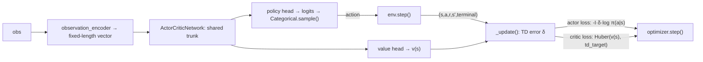

# ActorCritic — One-Step Online Actor-Critic

**ActorCritic** is this project's first **policy-gradient** baseline: instead of
learning Q-values and acting greedily (like [IQL](iql.md), [CQL](cql-mixed.md), and
[DQN](dqn.md) all do), it learns a stochastic policy $\pi_\theta(a \mid s)$ directly,
alongside a state-value critic $v_w(s)$ used only to reduce the policy gradient's
variance. It is **independent per agent**, mirroring DQN's structure: one network
and one optimizer each, with no shared value function between agents.

This is the *vanilla* actor-critic — Sutton & Barto's Algorithm 13.5, "Actor-Critic
(episodic), for estimating $\pi_\theta$" — not the batched A2C or asynchronous A3C
variants. See [Algorithms Overview → Roadmap](index.md#roadmap) for where those fit.

## Theory

At every step the critic computes a one-step TD error:

$$
\delta = r + \gamma\, (1 - \text{terminal})\, v_w(s') - v_w(s)
$$

which serves two purposes at once:

- **Critic update** — move $v_w(s)$ toward the TD target by minimizing a loss on
  $\delta$ (Huber, not raw $\delta^2$ — see below).
- **Actor update** — treat $\delta$ as an estimate of the advantage of the action
  actually taken, and push $\pi_\theta$ toward actions with positive $\delta$:

$$
\theta \leftarrow \theta + \alpha_\theta \, I \, \delta \, \nabla_\theta \ln \pi_\theta(a \mid s)
$$

$I$ starts at $1$ each episode and decays by $I \leftarrow \gamma I$ every step — it
downweights the actor's gradient for states reached later in the episode, which is
what makes this the correct on-policy gradient estimator rather than an ad-hoc
weighting.

Two things this algorithm deliberately **does not** have, unlike DQN:

- **No replay buffer** — on-policy learning requires each update to come from the
  current policy, not a mix of old and new behavior.
- **No target network** — the critic bootstraps off its own live value estimate;
  there is no separate slow-moving copy to stabilize against.

## How it works here



**Implementation:** `src/baselines/AC/`.

- `actor_critic.py` — the `ActorCritic` algorithm: per-agent `networks`,
  `optimizers`; `select_actions` samples from `Categorical(logits=...)` (the
  stochastic policy *is* the exploration — no epsilon schedule); `_update` computes
  the TD error, actor loss, and critic loss and takes one optimizer step per
  transition, immediately, every env step.
- `network.py` — `ActorCriticNetwork`: a shared MLP trunk feeding a policy head
  (per-action logits) and a value head (scalar), the same trunk-then-heads shape as
  `DuelingQNetwork`, repurposed for policy-gradient learning.

Like DQN, `ActorCritic` requires a **numeric** observation via
`env.observation_encoder`, and distinguishes true termination from timeout
truncation so the critic keeps bootstrapping through time-limit cut-offs (`_update`'s
`terminal` argument) — see [Training Loop](../flows/training-loop.md).

## Configuration

```yaml
experiment:
  algorithm:
    name: actor_critic
    params:
      hidden_layers: [128, 128]
      learning_rate: 0.001
      gamma: 0.99
      value_coef: 0.5     # weight on the critic's Huber loss in the combined loss
      entropy_coef: 0.01  # weight on the policy entropy bonus -- 0.0 let capture rate
      # collapse toward 0 over training; see "Fixes found through verification runs" below
      grad_clip: 5.0
      seed: 42
      device: "cpu"
      curves_path: "training_curves_actor_critic.csv"   # optional
```

```bash
python -m multi_agent_package.scripts.run_actor_critic
```

## Fixes found through verification runs

Passing unit tests confirmed the algorithm *executes* correctly; they didn't catch
either of the following, which only showed up in real training runs.

**Critic loss originally used plain squared error, not Huber.** On the shared
3-predator-vs-3-prey config (10x10 grid, 20% obstacles, predator speed 1 / prey
speed 3, 1000 episodes), predator critic loss sat at ~687,000 in Q1 and was still
~602,000 by Q4 — not shrinking, three orders of magnitude larger than DQN's loss
on comparable configs. Root cause: this environment's rewards accumulate into the
thousands per episode, and squared error on TD targets that large produces
gradients large enough to destabilize the shared trunk both heads depend on.
Switching to Huber (`SmoothL1Loss`) — the same fix DQN already uses — dropped
predator critic loss to ~211 → ~224 on the identical config, roughly a 3000x
reduction, confirming the diagnosis rather than run-to-run noise.

**`entropy_coef=0.0` let capture rate collapse toward zero.** Isolating the
question of "hard task vs. under-tuned algorithm" required a config with existing
DQN data to compare against directly: `configs/dqn_1v1` (1v1, predator speed 2 /
prey speed 1, 2000 episodes, matching DQN's own horizon on this config). With no
entropy bonus, capture rate declined steadily rather than staying flat:

| | Q1 | Q2 | Q3 | Q4 |
|---|:--:|:--:|:--:|:--:|
| Capture rate, `entropy_coef=0.0` | 6.4% | 5.6% | 3.4% | 0.6% |

Meanwhile critic loss dropped smoothly (20.4 → 0.33) — in isolation that looks like
convergence, but combined with the collapsing capture rate it's the signature of a
specific failure mode: the critic learns to predict a boring, predictable outcome
(timeout, no capture, steady shaping penalty) because the policy has stopped
attempting anything else. Low surprise = low loss, even as behavior gets worse.
Raising `entropy_coef` to `0.01` (the standard A2C/A3C default) on the identical
run fixed it:

| | Q1 | Q4 |
|---|:--:|:--:|
| Capture rate, `entropy_coef=0.0` | 6.4% | 0.6% (collapsing) |
| Capture rate, `entropy_coef=0.01` | 35.6% | 36.4% (stable) |

Confirmed by decile, not just quarter-level noise: `36.5%, 37%, 33.5%, 34.5%,
36.5%, 33.5%, 34%, 36%, 35%, 37.5%` — flat throughout, no late-training decay
anywhere in the run.

**One nuance, kept honest rather than smoothed over:** predator *reward* itself
stays deeply negative and roughly flat (~−3300 to −3450) even with the much
higher capture rate — the accumulated per-step distance-shaping penalty across
the ~65% of episodes that still end in timeout dominates the reward signal, so
"reward improving" and "actual task performance improving" are not the same story
here. Capture rate is the metric that actually reflects what changed; raw reward
does not. See [Algorithm Spec → MARL Constraints and Limitations](../specs/algorithm-spec.md#marl-constraints-and-limitations)
for this pattern confirmed across every baseline, not just ActorCritic.

Both fixes were validated cleanly on 1v1. Re-run on the harder 3v3 config, the
entropy fix is a wash on aggregate reward/critic-loss numbers, but raw log
analysis (counting capture events from episode length) shows captures occurring
steadily across all four quarters (~16-28%) rather than collapsing — so the fix
is *validated on 1v1, directionally consistent but not conclusively confirmed on
3v3*.

## When to use ActorCritic

- You want a **directly-learned stochastic policy** rather than a greedy-over-Q one
  (useful when the optimal policy itself should be stochastic, or when you want
  smooth exploration without an epsilon schedule to tune).
- You want the **on-policy counterpart to DQN** for a comparative study — same
  environment, same per-agent independence, different learning paradigm.

For faster wall-clock convergence in this small gridworld, DQN's replay buffer
typically gets more mileage out of each transition; ActorCritic's appeal is
algorithmic (on-policy, no replay/target-network machinery) rather than sample
efficiency.

## Papers

- Sutton & Barto (2018), *Reinforcement Learning: An Introduction*, 2nd ed.,
  Chapter 13 — the actor-critic derivation and Algorithm 13.5 this implementation
  follows directly.
- Mnih et al. (2016), *Asynchronous Methods for Deep Reinforcement Learning* — A3C,
  and the synchronous A2C variant referenced in the [Roadmap](index.md#roadmap).

Full list: [Papers & Further Reading](../reference/papers.md).
