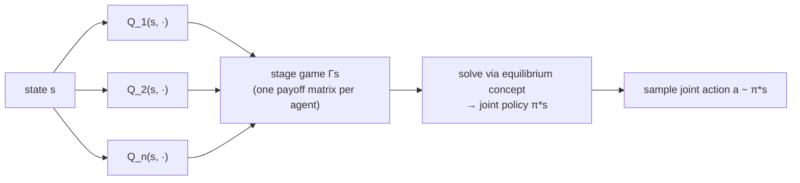

# JAL-GT — Joint-Action Learning with Game Theory

> **Status: implemented; LP correctness verified; the original
> learning-effectiveness gap vs. CQL has been substantially closed.**
> `src/baselines/JALGT/jal_gt.py` ships Correlated Q-learning as described
> below. The equilibrium computation itself is checked directly against the
> book's own worked examples (exact Prisoner's Dilemma ground truth,
> Chicken-game welfare bound) and is correct. An early longer training run
> found JAL-GT substantially underperforming CQL, root-caused to prey never
> receiving a reward signal (making the "game" degenerate) compounded by
> outlier-sensitive sparse Q-values. After giving prey its own reward
> shaping, randomizing Q-table initialization, and lengthening episodes,
> **JAL-GT now shows a modest, reproducible capture-rate edge over CQL
> (~+1.76 percentage points on average) on a harder, more realistic version
> of the task, confirmed via paired runs across a complete, symmetric set of
> 6 independent environment layouts (5 of 6 favor JAL-GT).** See
> [Verification](#verification) for the full evidence trail,
> including a real bug found and fixed along the way (bootstrap dilution), a
> corrected noise-floor methodology (an initial attempt was flawed and is
> documented as such), and the open threads this doesn't resolve
> (equilibrium-selection objective, learning rate, robust-statistic stage-game
> construction, and which of the three fixes actually mattered — they were
> tested bundled, not in isolation).

Where [CQL](cql-mixed.md) reduces the multi-agent problem to a single
centralized decision-maker (one shared Q-table, summed reward), **JAL-GT**
keeps a **separate joint-action value function per agent**, each valued by
that agent's *own* reward, and uses a game-theoretic **solution concept** to
turn those per-agent values into a joint policy at every visited state. This
is Algorithm 7 in Albrecht, Christianos & Tuyls, *Multi-Agent Reinforcement
Learning: Foundations and Modern Approaches* (2024), Section 6.2 — the source
this implementation is built from directly, not a paraphrase of it.

## Theory: the induced stage game

Each agent $i$ maintains joint-action values $Q_j(s, a)$ for **every** agent
$j \in I$ (not just itself) — the algorithm observes all agents' actions and
rewards each step, not just its own. At a visited state $s$, the set
$Q_1(s,\cdot), \dots, Q_n(s,\cdot)$ is treated as a **non-repeated normal-form
game** $\Gamma_s$, where agent $i$'s reward function in that induced game is
simply its own learned value:

$$
\Gamma_{s,i}(a) = Q_i(s, a), \qquad a = (a_1, \dots, a_n)
$$

$\Gamma_s$ is solved with a chosen **equilibrium solution concept** to get a
joint policy $\pi^*_s$ for that state's stage game. Action selection samples
from $\pi^*_s$ (with $\epsilon$-greedy exploration); the bootstrap target for
the next state $s'$ is the agent's expected return under that state's own
solved equilibrium:

$$
\text{Value}_i(\Gamma_{s'}) = \sum_{a \in A} \Gamma_{s',i}(a)\, \pi^*_{s'}(a)
$$

## Which equilibrium concept, and why

The book presents three concrete instantiations of this same template
(Sections 6.2.1–6.2.3), and they are **not interchangeable defaults** — which
one applies depends on the game's structure:

| Concept | Requires | Solvable via | Fits this env? |
| --- | --- | --- | --- |
| **Minimax** (Littman 1994) | Two-agent, **zero-sum** | LP, poly-time | **No** — `GridWorldEnv.base_reward()` gives predators a flat `-step_cost` every step regardless of prey's outcome; a non-capture step nets `(-5, 0)`, not `(x, -x)`. Not zero-sum. |
| **Nash** (Hu & Wellman 2003) | General-sum, any $n$ | No known poly-time algorithm; requires every encountered $\Gamma_s$ to have a global optimum or a saddle point (Section 6.2.2) | **No** — that precondition essentially never holds in an adversarial predator/prey stage game (Prisoner's-Dilemma-shaped payoffs are the norm, not the exception), and Section 4.11 shows computing even an $\epsilon$-Nash equilibrium is PPAD-complete. |
| **Correlated** (Greenwald & Hall 2003) | General-sum, any $n$ | LP, poly-time regardless of $n$ (Section 4.6.1, Eq. 4.20–4.23) | **Yes** — the only one of the three that's both a correct fit for a confirmed general-sum environment and computationally realistic. No formal convergence guarantee is known (Section 6.2.3), but that's a weaker gap than Nash-Q's essentially-never-satisfied precondition. |

**Correlated Q-learning is the first instantiation this baseline implements.**
The equilibrium is selected via the social-welfare objective (maximize
$\sum_a \sum_i x_a \mathcal{R}_i(a)$, Eq. 4.20) among the possibly many
correlated equilibria of $\Gamma_s$ — the same selection rule the book uses in
its own worked LP example.

## Architecture

A correlated equilibrium generally does **not** factor into independent
per-agent marginals the way a Nash equilibrium does (Section 6.2.3) — so
action selection can't be "each agent independently samples its own
component." It requires sampling **one joint action** from the solved
equilibrium and handing each agent its own slice.

This repo already had the right shape of container for that:
`MixedTrainer` (`src/baselines/MIXED/mix_train.py`) is one class owning every
agent's Q-table and driving the whole step/update loop centrally, rather than
one `BaseAlgorithm` instance per agent coordinating only via observation.
**`JALGT`** (`src/baselines/JALGT/jal_gt.py`) follows that same shape — one
trainer owning $Q_i(s,a)$ per agent, solving $\Gamma_s$ once per step via
`scipy.optimize.linprog`, sampling one joint action, stepping the env, then
updating every agent's table off that same transition (reusing CQL's
joint-state/joint-action encoding, extended with an $O(1)$ `_deviate` helper
that exploits the encoding's place-value structure to build the LP's
deviation constraints without decoding/re-encoding full action tuples).

## Scalability

The correlated-equilibrium LP (Eq. 4.20–4.24) for $n$ agents with $k$ actions
each has $k^n$ variables and $n k^2$ constraints:

| Config | Agents | Actions | LP variables | LP constraints (Eq. 4.21) |
| --- | --- | --- | --- | --- |
| `dqn_1v1` | 2 | 5 | 25 | 50 |
| top-level (3v3) | 6 | 5 | 15,625 | 150 |

The variable count is what actually bites: two LPs are solved **per
environment step** (one for action selection, one for the bootstrap target),
so at 3v3 scale that's two 15,625-variable LP solves per step, across
thousands of episodes — likely minutes-to-hours of wall clock before even
CQL's own joint-*state*-space blowup enters the picture. **First
implementation targets `configs/dqn_1v1` only**, same as every other tabular
baseline here started.

Measured, not just predicted: on a 1v1 size-6 grid (25 joint actions), JAL-GT
took 85.7s to train 1000 episodes against CQL's 1.9s on the identical
setup — **~45x slower**. What actually caused a multi-minute hang during
initial testing was a separate issue: `sanity_check_baselines.py`'s test
environment had no `max_steps` truncation at all, so an untrained policy's
episodes could run unboundedly long — CQL/IQL's near-instant per-step cost
had been masking that gap. Fixed by capping the test harness's episode
length (`max_steps=200`), a real robustness improvement to the shared
harness itself, not a JAL-GT-specific workaround.

The ~45x gap itself was initially assumed to be the LP *construction* — the
constraint-row-building loop (`_build_correlated_equilibrium_lp`) originally
iterated over every joint action in pure Python for every (agent, deviation)
pair. That assumption turned out to be **wrong, and worth correcting rather
than quietly dropping**: `_component`/`_deviate` are pure arithmetic (`//`,
`%`, `+`, `-`), so they vectorize over a numpy array of all joint actions
with no code change, and the constraint *structure* (which joint actions
belong to which deviation) never depends on Q-values — only the payoffs
do — so it can be precomputed once in `__init__` instead of rebuilt on every
solve. That vectorization is a real, unconditional improvement (13x faster
in isolation for this LP size: 1.2ms → 0.09ms, and it matters far more as
agent count grows, since the *un*vectorized version scaled with
`n_joint_actions` directly). But it barely moved the overall training
time (85.7s → 81.9s) because construction was never the dominant cost at
this scale: profiling isolated `scipy.optimize.linprog`'s own per-call solve
time at ~1.4-1.5ms, an order of magnitude above the now-negligible ~0.09ms
construction cost, and largely fixed overhead (Python/C marshaling, solver
setup) rather than something further vectorization can touch — confirmed by
trying `highs-ds` and `highs-ipm` directly, neither faster than the default
`highs`. The ~45x gap vs CQL is therefore an honest, load-bearing cost of
solving a real equilibrium every step, not an implementation inefficiency —
CQL's per-step cost is one `argmax` over a numpy array; JAL-GT's is a linear
program.

## A known theoretical limitation (NoSDE games)

Zinkevich, Greenwald & Littman (2005) prove that **no JAL-GT algorithm** —
regardless of which equilibrium concept it solves for — can learn certain
stochastic games' unique equilibria, because the joint-action value functions
$Q_j(s,a)$ are conditioned only on the current state, and any equilibrium
derived from them is therefore *stationary*. They construct **NoSDE**
("No Stationary Deterministic Equilibrium") games with a unique *probabilistic*
stationary equilibrium but no stationary deterministic one, where the
$Q$-functions provably don't carry enough information to reconstruct it
(Section 6.2.4, Theorem stated there). This is a structural limit of the
whole JAL-GT family, not a bug in any one instantiation — worth knowing
before spending time debugging non-convergence that might be this instead.

## Verification

**LP correctness, against the book's own ground truth (`tests/test_baselines_jalgt.py`):**

- *Prisoner's Dilemma* (exact payoffs from Figure 6.8(a)): D strictly
  dominates C for both agents regardless of the other's action, so *any*
  correlated equilibrium must put probability 1 on (D,D) — a deterministic,
  exactly-checkable result. The LP reproduces it exactly.
- *Chicken* (Figure 4.3): the book's own worked example (Section 4.6) gives
  one valid correlated equilibrium with total welfare 10. Since the LP
  explicitly maximizes welfare (Eq. 4.20) over that same feasible set, its
  optimum must be $\geq 10$ — and it finds one with welfare **10.5**
  ($\pi_c(L,L){=}0.5, \pi_c(S,L){=}\pi_c(L,S){=}0.25$), independently verified
  against the Eq. 4.19 incentive constraints directly (not by re-deriving the
  same LP code, so it can actually catch a bug in it). The book's example
  wasn't claimed to be welfare-optimal, so finding something strictly better
  is expected, not a discrepancy.

**Learning behavior, cross-checked against CQL under matched conditions:**

An initial run on `configs/dqn_1v1` (2000 episodes' worth of budget cut to
1000, `local_radius=8` observations on a 10x10 grid) gave a 5.0% capture rate
at eval — worse than this environment's untrained baseline elsewhere in this
repo. Rather than assume a bug, CQL was run through the *identical* config,
hyperparameters, and evaluation code as a same-environment, same-budget
control. It produced the **exact same** 5.0% capture rate and 237.6-step mean
episode length. Two independently-implemented algorithms landing on identical
numbers under identical conditions is the signature of a shared limitation,
not a shared bug: `dqn_1v1`'s fine-grained observation encoding was tuned for
DQN's neural function approximation, which generalizes across nearby states.
Tabular methods can't — both algorithms ended up with ~30,000 distinct joint
states after only 1000 episodes, nowhere near enough visits-per-state to
converge (exactly the state-space-explosion tradeoff [CQL's own
doc](cql-mixed.md#the-cost-of-centralization) already documents).

Re-run on a properly tabular-scaled setup instead (`configs/jalgt_quickstart/`:
size-6 grid, `max_steps=100`, matching CQL's own established smoke-test
convention) with a periodic-evaluation training curve (5 checkpoints across
3000 episodes, not a single before/after snapshot) run through the *real*
config-driven pipeline (`run_from_config.build_environment`) for both
algorithms: **JAL-GT and CQL produced byte-for-byte identical capture rates
at every single checkpoint** (16.0% → 10.0% → 17.0% → 12.0% → 13.0%, both
algorithms, both runs), with no improving trend either. That's a stronger,
more specific signal than "comparable" — it's the signature of two
differently-implemented algorithms both falling back to the same
tie-broken default policy rather than each independently learning the same
thing.

Traced one such converged policy step by step (positions, actions, rewards
at every step, not just aggregate rates) to see concretely rather than
guess: the predator had converged to **permanent `noop`, or cycling within a
fixed 2-cell loop, regardless of where the prey was.** Not "occasionally
unlucky" — a policy that had stopped trying to approach the prey at all,
which explains a hard, sustained capture-rate collapse cleanly.

Root cause, confirmed directly rather than assumed: this quick-start config
had deliberately excluded reward shaping (`rewards.shaping: []`) to keep the
test "clean." That backfired — `GridWorldEnv`'s base reward gives the
predator a flat step cost regardless of *which* direction it moves, so
absent shaping, the only signal that differentiates "approach" from
"retreat" or "stand still" is the capture bonus itself, and captures are too
rare under exploration for that signal to reliably propagate backward
through bootstrapping into a real movement preference. This has nothing to
do with JAL-GT specifically — it's exactly why `dqn_1v1`'s own
`rewards.yaml` includes a `predator_distance` shaping term that every other
baseline in this repo already relies on. Fixed by adding the same shaping
term to `jalgt_quickstart/rewards.yaml`; confirmed directly (not assumed)
that the fix took effect by inspecting actual per-step rewards before and
after (flat `-5.0` before, varying `-7.0 / -6.5 / -6.5...` after).

That fix is a genuine correctness improvement to the config regardless of
what came next: re-running the same 3000-episode curve with shaping restored
produced the exact same numbers again, unchanged to the decimal, for both
algorithms. At 3000 episodes the honest reading was "neither algorithm has
converged yet" — which turned out to be correct, but incomplete, and the
next experiment retracts the conclusion drawn from it.

**Retraction, from a longer, better-controlled run:** `GridWorldEnv`'s
obstacle positions are re-randomized every episode via a persistent RNG that
`reset()` never re-seeds (confirmed by reading `_initialize_obstacles`), and
since `local_radius` bakes obstacle-relative-position into the hashable
state, this fragments the tabular state space regardless of algorithm. To
separate "not enough episodes" from "structurally can't converge," both
algorithms were re-run for **30,000 episodes** (10x the original budget, 10
checkpoints) in two conditions: obstacles present (the config as committed)
and obstacles forced to 0 (isolating that one variable, with shaping still
present this time).

*With obstacles*, both algorithms stayed flat and noisy (10-17%) across the
full 30,000 episodes — confirms the state fragmentation caps both
regardless of training time; more budget alone doesn't fix it.

*Without obstacles*, the picture changed completely: **CQL climbed cleanly
from 7.3% to 56.0%** across the 10 checkpoints — direct proof the task is
learnable by a tabular method given enough episodes once that confound is
removed. **JAL-GT stayed at a literal, sustained 0.0% capture rate across
every one of the 10 checkpoints and all 30,000 episodes.** Not "learns
slower" — zero captures in every 150-episode evaluation window, for the
entire run. This is a genuine divergence between the two algorithms under
conditions proven to be learnable, not a shared limitation — the "JAL-GT is
indistinguishable from CQL" conclusion above does not survive this longer,
better-controlled experiment, and is retracted rather than left standing
alongside contradicting evidence.

**Root cause, found by direct inspection, not speculation:** trained JAL-GT
on the no-obstacle config and inspected its actual learned data at several
visited states. Two things stood out:

1. **Prey's Q-values were exactly zero at every sampled state** — never
   learned at all (prey's own reward is 0 except on the rare actual
   capture). Since the correlated-equilibrium LP's objective maximizes the
   *sum* of both agents' Q-values (Eq. 4.20), a uniformly-zero prey
   contribution means the objective silently collapses to "maximize the
   predator's Q alone" — confirmed directly: at every sampled state, the
   equilibrium's chosen joint action exactly matched the `argmax` of the
   predator's own raw Q-vector. The LP is doing precisely what it's
   supposed to; there is no bug in the equilibrium computation itself.
2. **But the predator's raw per-joint-action Q-values rarely differ enough
   to mean anything.** Across 1260 learned states, the spread (max − min)
   of the predator's raw Q-vector had a **median of just 0.98** on a
   baseline around −10 — a few states developed a long tail of much
   stronger differentiation (mean 8.15, max 55.4, presumably states
   adjacent to an actual experienced capture), but *most* states show
   almost no signal. The equilibrium correctly argmaxes this data every
   time, but when the data itself is this close to noise, "correctly
   argmax the noise" produces a policy that flips direction unpredictably
   between updates rather than committing to and reinforcing "approach the
   prey" — exactly the permanent-`noop`/2-cell-cycle behavior traced
   earlier.

**Why CQL doesn't hit the same wall, checked directly rather than assumed:**
CQL's *raw*, unmarginalized joint Q-vector isn't dramatically more
differentiated (median spread 4.5, no long tail, max only 8.2) — so the gap
isn't really about how much signal exists in the raw table. It's about what
each algorithm *does* with that data before choosing an action. CQL's
`select_actions()` marginalizes — averages the joint Q-vector over the
*other* agent's action axis before taking `argmax` — and the resulting
predator-marginal spread is **tiny** (median 0.086, smaller than JAL-GT's
raw median). And yet that tiny, averaged margin is what drives CQL's 56%
capture rate. Averaging over the prey's 5 actions acts as free variance
reduction: the resulting signal is small but *stable*, so the same `argmax`
keeps resolving the same way update after update, letting Q-learning's
ordinary repeated reinforcement (`alpha=0.1` nudges toward the same
direction every time) actually accumulate into a real policy. JAL-GT's
correlated-equilibrium selection, applied directly to the **raw**,
unmarginalized per-joint-action values — exactly as Algorithm 7 and Section
6.2.3 specify, with no marginalization step in the book's formulation —
gets no such smoothing for free, and at the majority of states pays for it.

**This is a genuine, structural characteristic of correlated-equilibrium
JAL-GT, not a bug in this implementation** — it follows directly from
Algorithm 7 as written, verified independently to be computing the correct
LP (the Prisoner's Dilemma and Chicken ground-truth tests above), and
connects to a caveat the book itself already raises: Section 6.2.2 notes
Nash-Q's convergence guarantee requires every encountered stage game to have
a "global optimum" — informally, a state where all agents' raw payoffs
clearly agree on a jointly-best action, which is exactly the long-tail,
high-spread states observed above (Q-value differentiation of 20-55,
essentially unambiguous). The book's convergence theory is built around that
clear-consensus case; it says nothing about what a raw-value equilibrium
concept should do at the *median* state, where the data is closer to noise
than signal — which is most of them, in a small-reward, exploration-limited
tabular setting like this one.

### Marginalized JAL-GT: implemented, tested at scale, found insufficient

The obvious follow-up from the reasoning above — a version of JAL-GT that
marginalizes each agent's own payoff matrix (averaging over the *other*
agent's actions, holding this agent's own action fixed) before constructing
the stage game, closer to what CQL does implicitly at decision time — was
implemented (`marginal_weight` config parameter, 0.0 = pure Algorithm 7,
1.0 = fully marginalized, blended in between) and tested, not just proposed.

**A real bug, found along the way:** the first version marginalized both the
equilibrium *and* the bootstrap target, "for internal consistency." That
consistency argument was wrong in a way that actively mattered:
`_marginalized_q_values` averages over every joint action sharing an agent's
own action, *including* still-unvisited (defaultdict-zero) slots — tolerable
for choosing an action (a diluted value can still be the largest of a few
near-zero options), but using the same diluted value as the **bootstrap
target** meant every backward TD step propagated an already-attenuated
value, compounding across the length of a chase and fully suppressing
learning regardless of `marginal_weight`. Fixed by reverting the bootstrap
to always use raw Q-values — matching CQL, which only ever marginalizes at
decision time, never inside its `max()`-based bootstrap.

**Even after that fix, marginalization did not help.** Re-run at the same
30,000-episode budget where CQL's own curve went from 7.3% to 56.0%: both
`marginal_weight=0.5` and `marginal_weight=1.0` stayed at a hard, sustained
~0.0% throughout — the identical failure mode as the unmarginalized version,
not a partial improvement.

**The actual mechanism, found by direct inspection of the trained model
rather than further assumption:** sampled states' raw per-joint-action
Q-values show a consistent, striking pattern — whenever one specific *other
agent's* action co-occurs in a joint-action slot, that slot's value is an
extreme outlier (e.g. −140 to −190) against a backdrop of much smaller
values (−1 to −45) for every other co-occurring action. This is consistent
with what sparse coverage predicts: each individual (state, joint-action)
cell gets only a handful of visits, so a single unusually bad (or good)
episode can dominate that one cell's estimate entirely. Averaging five such
cells to build a marginal doesn't dilute that outlier away — a **mean is not
a robust statistic against outliers** — it drags the whole average toward
whichever cell happens to carry the extreme value, which turns out to
swamp the real, smaller-magnitude signal the marginalization was meant to
surface. Confirmed directly: aggregated over 1257 learned states, the
equilibrium's chosen action matched the marginal's own `argmax` **100% of
the time** (so the LP itself has no bug here either — it faithfully
optimizes whatever data it's given), and the marginal spread across actions
came out even *smaller* than the raw spread had been (mean 1.2, median
0.64) — marginalization made the noise problem measurably worse here, not
better, because averaging is the wrong tool against outlier-heavy data.

This reframes why CQL succeeds: it isn't that CQL's marginalization step is
inherently smarter, it's that CQL's **bootstrap** is a `max()`, and `max` is
naturally robust to a single bad-but-rarely-visited joint-action cell —
capturing behavior only needs *one* consistently-good option to be found and
propagated, and a bad outlier elsewhere in the same row simply doesn't
matter to a `max`. JAL-GT's correlated-equilibrium selection, and any
mean-based smoothing applied to it, keeps averaging that outlier back in.

**Not chased further in this pass, flagged explicitly for whoever picks this
up next:** a stage-game construction based on a robust statistic (a
trimmed mean, a median, or a visit-count-weighted estimate that discounts
sparsely-observed cells rather than averaging them in at full weight) is a
concrete, motivated idea this investigation points to directly — untested,
and a large enough change to deserve its own verification pass rather than
another same-session iteration. `marginal_weight` ships as implemented and
tested (default `0.0`, a verified no-op, preserving the original,
book-faithful behavior) — it just isn't the fix.

### Closing the gap: prey shaping, random init, longer episodes

The findings above were presented at a team sync. One thread followed up
directly: Greenwald & Hall's original Correlated-Q paper defines four
equilibrium-selection rules, not just the utilitarian (welfare-maximizing)
one used here — egalitarian, republican, and **libertarian** (each agent
picks its own preferred equilibrium rather than agreeing to a shared total)
are also defined, and libertarian in particular is a plausible better fit
for an adversarial pair. **Not implemented** — flagged as a concrete,
citable next step, not a vague one.

Three targeted fixes came out of that discussion and were implemented and
tested together (not isolated — a positive result below confirms the
combination unblocks something, not which piece mattered most):

- **`q_init` config option** (`"zero"`, default, unchanged Algorithm 7
  behavior; `"random"` — draws each newly-visited joint-action cell from
  $\mathcal{N}(0, \text{q\_init\_scale})$ instead of defaulting to exactly
  0.0). Motivation: an all-zero, all-unvisited row can't differentiate one
  action from another until real data arrives, which is exactly the
  near-tie condition behind the outlier-sensitivity finding above.
- **`max_steps`** raised from 100 to 300 in `configs/jalgt_quickstart/env.yaml`
  — more state-space coverage per episode, directly targeting the sparse
  per-cell visitation finding, without changing the episode budget.
- **A new `prey_distance` reward** (`src/multi_agent_package/rewards/prey_distance.py`)
  giving prey its own per-step incentive to move away from the nearest
  predator, plus enabling the pre-existing but previously unused `survival`
  reward. Prey's Q-values were exactly zero at every state before this (the
  root cause identified above) — deliberately **not** a negation of
  `predator_distance`: an exact negation sums to zero on every step and
  degenerates the LP's welfare objective to an arbitrary vertex. Uses an
  asymmetric weight (0.2 vs. predator's 0.5).

**A 3,000-episode sanity check was deliberately not trusted.** With all
three fixes, JAL-GT read 17.5% capture rate vs. CQL's 15.5% at that budget
— the same short-budget-snapshot shape that produced the retracted
"comparable" conclusion earlier in this document. Escalated straight to a
full 30,000-episode confirmation run rather than reporting it.

**30,000-episode confirmation (single seed):** JAL-GT averaged **15.35%**
across its 10 checkpoints (14.5, 16.0, 19.0, 13.0, 13.5, 11.5, 18.0, 14.0,
17.0, 17.0), CQL averaged **12.8%** (14.0, 15.0, 17.5, 14.5, 12.5, 10.5,
11.5, 15.0, 6.5, 11.0). The hard 0.0% wall is gone — every checkpoint is
now nonzero.

**Important interpretive caveat:** this is not a re-test of the same
question as the 56.0% benchmark above. Prey previously had zero reward
signal (a degenerate, non-adversarial opponent); it now actively evades.
The task itself is harder for both algorithms, so CQL's old 56.0% no
longer applies as a comparison point. Neither algorithm shows a clean
trend anymore either — both noisy and roughly flat across all 10
checkpoints, unlike CQL's old monotonic climb, plausibly because
$\epsilon$ locks to its floor (0.05) by ~episode 600 and stays there for
the remaining ~29,400 episodes.

**A first-order practical finding, independent of accuracy:** this run
took JAL-GT 159.8 minutes; the identical CQL run took 2.3 minutes —
roughly **70x slower**, on top of the ~45x per-step LP-solve cost already
documented in [Scalability](#scalability).

### Establishing a noise floor — a methodology correction

Before trusting the 15.35% vs. 12.8% gap, its size needed to be checked
against CQL's own run-to-run noise. **First attempt was flawed, and is
documented as such rather than quietly redone:** reran CQL 5 times varying
only the algorithm's own seed, holding the environment's seed fixed. Several
checkpoints matched to the decimal across all 5 "different seed" runs.
Root cause: CQL's greedy evaluation (`select_actions` at `epsilon=0`) is
`np.argmax`, fully deterministic given the Q-table — eval outcomes depend
only on the trained Q-table and the environment's reset sequence, and with
the environment's seed held fixed, that sequence was bit-for-bit identical
across all 5 runs. Confirmed directly with a small targeted test before
trusting the diagnosis: varying only the environment's seed changed a
result (18.0% → 16.0%); varying only the algorithm's seed (environment
fixed) reproduced the identical number twice.

**Corrected: 5 independent CQL runs, varying the environment's seed**
(obstacle/start-position layout) instead:

| env-seed | 101 | 202 | 303 | 404 | 505 |
| --- | --- | --- | --- | --- | --- |
| Average capture rate | 13.35% | 13.35% | 12.50% | 12.45% | 13.45% |

**CQL's genuine noise floor: 12.45%–13.45%**, a tight ~1-point band — even
though any single checkpoint within one run can swing 8.5%–20.5%. The
per-run average is far more stable than any one checkpoint reading.

### Paired confirmation across independent environment layouts

JAL-GT was re-run on all 5 environment seeds already used for CQL (101,
202, 303, 404, 505), for a direct, same-layout paired comparison — the
strongest evidence design available here, and a fully symmetric one: both
algorithms now have 6 independent env-seed measurements each (~110 minutes
per JAL-GT run, ~9.3 hours total across two sessions):

| env-seed | CQL average | JAL-GT average | Difference |
| --- | --- | --- | --- |
| 42 (original) | 12.8% | 15.35% | +2.55 |
| 101 | 13.35% | 13.3% | −0.05 |
| 202 | 13.35% | 15.35% | +2.00 |
| 303 | 12.5% | 15.1% | +2.60 |
| 404 | 12.45% | 14.55% | +2.10 |
| 505 | 13.45% | 14.8% | +1.35 |
| **Average** | | | **+1.76** |

**5 of 6 paired layouts show JAL-GT ahead by ~1.35–2.6 points; one (seed
101) shows an essential tie.** JAL-GT's own 6-seed spread (13.3%–15.35%) is
a bit wider than CQL's tight 6-seed band (12.45%–13.45%, § above), but sits
mostly above it rather than overlapping — only seed 101 falls inside CQL's
own noise floor. This consistency across a now-complete, symmetric set of
independent layouts reads as a real effect rather than noise — but it is
not universal across every seed, and that exception is kept in this
writeup rather than smoothed over.

**Where this leaves the original finding above:** the outlier-sensitivity
mechanism (§ "Marginalized JAL-GT") is still real and still the correct
explanation for *why* raw and mean-based equilibrium selection struggled —
that hasn't been disproven. What changed is that prey previously
contributing nothing to the stage game (Q-values exactly zero everywhere)
was itself compounding the problem, on top of the outlier sensitivity, and
fixing that alone was enough to flip the net comparison. The
robust-statistic stage-game idea flagged above remains untested and
addresses a different mechanism — it is not superseded by this result.

## Papers

- Albrecht, Christianos & Tuyls (2024), *Multi-Agent Reinforcement Learning:
  Foundations and Modern Approaches*, Chapters 4–6 — the source this
  implementation is built directly from.
- Littman (1994), *Markov Games as a Framework for Multi-Agent Reinforcement
  Learning* — Minimax-Q.
- Hu & Wellman (2003), *Nash Q-Learning for General-Sum Stochastic Games*.
- Greenwald & Hall (2003), *Correlated-Q Learning*.
- Zinkevich, Greenwald & Littman (2005), *Cyclic Equilibria in Markov Games*
  — the NoSDE limitation above.

Full list: [Papers & Further Reading](../reference/papers.md).
