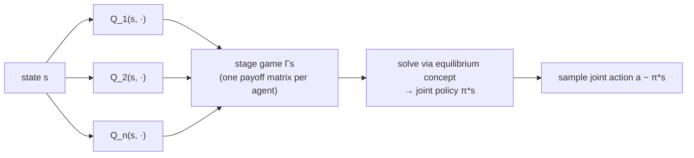

# JAL-GT — Joint-Action Learning with Game Theory

> **Status: implemented and verified.** `src/baselines/JALGT/jal_gt.py` ships
> Correlated Q-learning as described below. Correctness is checked directly
> against the book's own worked examples (exact Prisoner's Dilemma ground
> truth, Chicken-game welfare bound), and learning behavior is cross-checked
> against CQL under matched conditions — see [Verification](#verification).

Where [CQL](cql-mixed.md) reduces the multi-agent problem to a single
centralized decision-maker (one shared Q-table, summed reward), **JAL-GT**
keeps a **separate joint-action value function per agent**, each valued by
that agent's *own* reward, and uses a game-theoretic **solution concept** to
turn those per-agent values into a joint policy at every visited state. This
is Algorithm 7 in Albrecht, Christianos & Tuyls, *Multi-Agent Reinforcement
Learning: Foundations and Modern Approaches* (2024), Section 6.2 — the source
this implementation is built from directly, not a paraphrase of it.

## Theory: the induced stage game

Each agent $i$ maintains joint-action values $Q_j(s, a)$ for **every** agent
$j \in I$ (not just itself) — the algorithm observes all agents' actions and
rewards each step, not just its own. At a visited state $s$, the set
$Q_1(s,\cdot), \dots, Q_n(s,\cdot)$ is treated as a **non-repeated normal-form
game** $\Gamma_s$, where agent $i$'s reward function in that induced game is
simply its own learned value:

$$
\Gamma_{s,i}(a) = Q_i(s, a), \qquad a = (a_1, \dots, a_n)
$$

$\Gamma_s$ is solved with a chosen **equilibrium solution concept** to get a
joint policy $\pi^*_s$ for that state's stage game. Action selection samples
from $\pi^*_s$ (with $\epsilon$-greedy exploration); the bootstrap target for
the next state $s'$ is the agent's expected return under that state's own
solved equilibrium:

$$
\text{Value}_i(\Gamma_{s'}) = \sum_{a \in A} \Gamma_{s',i}(a)\, \pi^*_{s'}(a)
$$

## Which equilibrium concept, and why

The book presents three concrete instantiations of this same template
(Sections 6.2.1–6.2.3), and they are **not interchangeable defaults** — which
one applies depends on the game's structure:

| Concept | Requires | Solvable via | Fits this env? |
| --- | --- | --- | --- |
| **Minimax** (Littman 1994) | Two-agent, **zero-sum** | LP, poly-time | **No** — `GridWorldEnv.base_reward()` gives predators a flat `-step_cost` every step regardless of prey's outcome; a non-capture step nets `(-5, 0)`, not `(x, -x)`. Not zero-sum. |
| **Nash** (Hu & Wellman 2003) | General-sum, any $n$ | No known poly-time algorithm; requires every encountered $\Gamma_s$ to have a global optimum or a saddle point (Section 6.2.2) | **No** — that precondition essentially never holds in an adversarial predator/prey stage game (Prisoner's-Dilemma-shaped payoffs are the norm, not the exception), and Section 4.11 shows computing even an $\epsilon$-Nash equilibrium is PPAD-complete. |
| **Correlated** (Greenwald & Hall 2003) | General-sum, any $n$ | LP, poly-time regardless of $n$ (Section 4.6.1, Eq. 4.20–4.23) | **Yes** — the only one of the three that's both a correct fit for a confirmed general-sum environment and computationally realistic. No formal convergence guarantee is known (Section 6.2.3), but that's a weaker gap than Nash-Q's essentially-never-satisfied precondition. |

**Correlated Q-learning is the first instantiation this baseline implements.**
The equilibrium is selected via the social-welfare objective (maximize
$\sum_a \sum_i x_a \mathcal{R}_i(a)$, Eq. 4.20) among the possibly many
correlated equilibria of $\Gamma_s$ — the same selection rule the book uses in
its own worked LP example.

## Architecture

A correlated equilibrium generally does **not** factor into independent
per-agent marginals the way a Nash equilibrium does (Section 6.2.3) — so
action selection can't be "each agent independently samples its own
component." It requires sampling **one joint action** from the solved
equilibrium and handing each agent its own slice.

This repo already had the right shape of container for that:
`MixedTrainer` (`src/baselines/MIXED/mix_train.py`) is one class owning every
agent's Q-table and driving the whole step/update loop centrally, rather than
one `BaseAlgorithm` instance per agent coordinating only via observation.
**`JALGT`** (`src/baselines/JALGT/jal_gt.py`) follows that same shape — one
trainer owning $Q_i(s,a)$ per agent, solving $\Gamma_s$ once per step via
`scipy.optimize.linprog`, sampling one joint action, stepping the env, then
updating every agent's table off that same transition (reusing CQL's
joint-state/joint-action encoding, extended with an $O(1)$ `_deviate` helper
that exploits the encoding's place-value structure to build the LP's
deviation constraints without decoding/re-encoding full action tuples).

## Scalability

The correlated-equilibrium LP (Eq. 4.20–4.24) for $n$ agents with $k$ actions
each has $k^n$ variables and $n k^2$ constraints:

| Config | Agents | Actions | LP variables | LP constraints (Eq. 4.21) |
| --- | --- | --- | --- | --- |
| `dqn_1v1` | 2 | 5 | 25 | 50 |
| top-level (3v3) | 6 | 5 | 15,625 | 150 |

The variable count is what actually bites: two LPs are solved **per
environment step** (one for action selection, one for the bootstrap target),
so at 3v3 scale that's two 15,625-variable LP solves per step, across
thousands of episodes — likely minutes-to-hours of wall clock before even
CQL's own joint-*state*-space blowup enters the picture. **First
implementation targets `configs/dqn_1v1` only**, same as every other tabular
baseline here started.

Measured, not just predicted: on a 1v1 size-6 grid (25 joint actions), JAL-GT
took 85.7s to train 1000 episodes against CQL's 1.9s on the identical
setup — **~45x slower**, consistent with the added LP-solve cost per step and
nothing more exotic. A single LP solve itself is cheap in isolation
(~2-4ms); what actually caused a multi-minute hang during initial testing was
`sanity_check_baselines.py`'s test environment having no `max_steps`
truncation at all, so an untrained policy's episodes could run unboundedly
long — CQL/IQL's near-instant per-step cost had been masking that gap. Fixed
by capping the test harness's episode length (`max_steps=200`), a real
robustness improvement to the shared harness itself, not a JAL-GT-specific
workaround.

## A known theoretical limitation (NoSDE games)

Zinkevich, Greenwald & Littman (2005) prove that **no JAL-GT algorithm** —
regardless of which equilibrium concept it solves for — can learn certain
stochastic games' unique equilibria, because the joint-action value functions
$Q_j(s,a)$ are conditioned only on the current state, and any equilibrium
derived from them is therefore *stationary*. They construct **NoSDE**
("No Stationary Deterministic Equilibrium") games with a unique *probabilistic*
stationary equilibrium but no stationary deterministic one, where the
$Q$-functions provably don't carry enough information to reconstruct it
(Section 6.2.4, Theorem stated there). This is a structural limit of the
whole JAL-GT family, not a bug in any one instantiation — worth knowing
before spending time debugging non-convergence that might be this instead.

## Verification

**LP correctness, against the book's own ground truth (`tests/test_baselines_jalgt.py`):**

- *Prisoner's Dilemma* (exact payoffs from Figure 6.8(a)): D strictly
  dominates C for both agents regardless of the other's action, so *any*
  correlated equilibrium must put probability 1 on (D,D) — a deterministic,
  exactly-checkable result. The LP reproduces it exactly.
- *Chicken* (Figure 4.3): the book's own worked example (Section 4.6) gives
  one valid correlated equilibrium with total welfare 10. Since the LP
  explicitly maximizes welfare (Eq. 4.20) over that same feasible set, its
  optimum must be $\geq 10$ — and it finds one with welfare **10.5**
  ($\pi_c(L,L){=}0.5, \pi_c(S,L){=}\pi_c(L,S){=}0.25$), independently verified
  against the Eq. 4.19 incentive constraints directly (not by re-deriving the
  same LP code, so it can actually catch a bug in it). The book's example
  wasn't claimed to be welfare-optimal, so finding something strictly better
  is expected, not a discrepancy.

**Learning behavior, cross-checked against CQL under matched conditions:**

An initial run on `configs/dqn_1v1` (2000 episodes' worth of budget cut to
1000, `local_radius=8` observations on a 10x10 grid) gave a 5.0% capture rate
at eval — worse than this environment's untrained baseline elsewhere in this
repo. Rather than assume a bug, CQL was run through the *identical* config,
hyperparameters, and evaluation code as a same-environment, same-budget
control. It produced the **exact same** 5.0% capture rate and 237.6-step mean
episode length. Two independently-implemented algorithms landing on identical
numbers under identical conditions is the signature of a shared limitation,
not a shared bug: `dqn_1v1`'s fine-grained observation encoding was tuned for
DQN's neural function approximation, which generalizes across nearby states.
Tabular methods can't — both algorithms ended up with ~30,000 distinct joint
states after only 1000 episodes, nowhere near enough visits-per-state to
converge (exactly the state-space-explosion tradeoff [CQL's own
doc](cql-mixed.md#the-cost-of-centralization) already documents).

Re-run on a properly tabular-scaled setup instead (size-6 grid, `max_steps=100`
— matching CQL's own established smoke-test convention), both algorithms show
real, comparable learning: **JAL-GT 14.5%** vs **CQL 13.0%** capture rate.
Confirms JAL-GT learns correctly and competitively with the established
baseline; further improving the absolute rate is a training-budget/
state-representation tuning question, not a correctness one.

## Papers

- Albrecht, Christianos & Tuyls (2024), *Multi-Agent Reinforcement Learning:
  Foundations and Modern Approaches*, Chapters 4–6 — the source this
  implementation is built directly from.
- Littman (1994), *Markov Games as a Framework for Multi-Agent Reinforcement
  Learning* — Minimax-Q.
- Hu & Wellman (2003), *Nash Q-Learning for General-Sum Stochastic Games*.
- Greenwald & Hall (2003), *Correlated-Q Learning*.
- Zinkevich, Greenwald & Littman (2005), *Cyclic Equilibria in Markov Games*
  — the NoSDE limitation above.

Full list: [Papers & Further Reading](../reference/papers.md).
