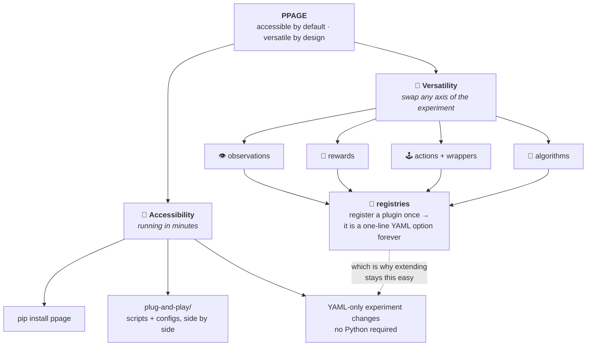

# Design Philosophy

PPAGE is built around one deliberate balance: **accessible by default,
versatile by design**. Most environments pick a side. Turnkey benchmarks are
easy to run and hard to modify; research scaffolds are endlessly modifiable
and take a week to stand up. PPAGE's architecture exists to refuse that
trade-off.

## The accessibility pillar

Getting a first result must cost minutes:

- **`pip install ppage`** gives the environment and tabular baselines with a
  light dependency footprint; `pip install "ppage[baselines]"` adds PyTorch
  for the neural ones.
- **One front door.** Everything runnable lives in
  [`plug-and-play/`](https://github.com/UHUMALAB/PPAGE/tree/main/plug-and-play),
  where the scripts sit next to the YAML configs they consume. There is no
  hunt through the package for an entry point.
- **Configuration is the experiment.** Grid size, agent roster, perception,
  incentives, action semantics, algorithm, and seed are all YAML keys.
  Changing what an experiment *does* never requires touching Python, and an
  identical config plus seed reproduces an identical trajectory.
- **A reading ladder.** [Quickstart](../guides/quickstart.md) →
  [tutorials](../tutorials/first-experiment.md) → [guides](../guides/custom-reward.md)
  → [specs](../specs/algorithm-spec.md), so each audience can stop at its
  own depth.

## The versatility pillar

Every scientific axis of variation is an independent plugin behind a
registry, with an immutable physics core underneath (enforced by the
`core-guard` CI check, see [Architecture](architecture.md)):

| Axis | Contract | Shipped implementations |
| --- | --- | --- |
| Observations | [`ObservationBuilder`](../specs/observation-builder-spec.md): `build(env)` + `encode(obs, env)` | `default`, `local_only`, `local_radius`, `absolute`, `relative` |
| Rewards | [`RewardFunction`](../specs/reward-function-spec.md): `compute(env)`; terms compose | `base`, `predator_distance`, `survival` |
| Actions | [`ActionSpace`](../specs/action-space-spec.md): `to_direction(action)` | `discrete_5`, `cross`, `speed_discrete_5` |
| Wrappers | follows the `SpeedWrapper` pattern | `SpeedWrapper` (per-agent speed/stamina) |
| Algorithms | [`BaseAlgorithm`](../specs/algorithm-spec.md): `select_actions(obs)` + `train()` | IQL, CQL, MixedTrainer, DQN, ActorCritic, A2C, A3C |

## The bridge: registries

The reason the two pillars don't fight: a plugin registered once is a config
option forever. Write the subclass, add one registry line, and your extension
is immediately selectable from YAML through the exact pipeline every shipped
implementation uses. Extending the system is as accessible as using it, and
the architecture-contract tests hold your plugin to the same rules.

## Four scenarios, one unchanged core

<table>
  <tr>
    <td width="50%" align="center">
      
       <b>1 predator vs 1 prey</b> · 10&times;10
    </td>
    <td width="50%" align="center">
      
       <b>2 predators vs 2 prey at double speed</b> · 10&times;10 speed/stamina via <code>SpeedWrapper</code>
    </td>
  </tr>
  <tr>
    <td width="50%" align="center">
      
       <b>Two predator teams vs 10 prey</b> · 50&times;50 cardinal movement (red) vs diagonal movement (pink)
    </td>
    <td width="50%" align="center">
      
       <b>5 predators vs 20 prey</b> · 100&times;100 1,000 obstacles
    </td>
  </tr>
</table>

Every clip runs at 10% obstacle density with **untrained, uniformly random
actions**: they show what the environment can be configured to express, not
learned behaviour. Colours and marker shapes are the environment's own, from
[`Agent.get_agent_color()`](../reference/api-reference.md) (predators on the red
hue, prey on green, with shade and shape separating subteams), and the two
movement geometries in the third clip are the shipped `discrete_5` and `cross`
action spaces.

!!! note "What is config and what is not"
    Grid size, populations, obstacle density, and per-agent speed/stamina are
    all YAML keys, so the first, second, and fourth clips are pure
    configuration. Assigning a *different* action space per team is not: the
    core holds one global `action_space_plugin`, and the third clip composes
    per-team geometry in the generator script through the core's per-agent
    direction-map fallback. Making that YAML-selectable is Tier 1 work on the
    [roadmap](scope-and-roadmap.md).

Regenerate the clips with `python .github/scripts/make_showcase_gifs.py`
(needs `pip install -e ".[docs]"`).

## The extension menu

Everything below is buildable **today, with zero core changes**. Difficulty
is calibrated to a student audience (★ = a first contribution, ★★★ = a
capstone or research project).

### Observations ★–★★

- **Noisy sensors** ★ — seeded Gaussian jitter on distances; determinism is
  preserved because noise flows through the seeded generator.
- **Field-of-view cones** ★★ — agents see only a directional wedge.
- **Line-of-sight occlusion** ★★ — obstacles block vision.
- **Frame-stacking memory** ★★ — the last *k* observations, for
  partial-observability studies.
- **Egocentric grid patch** ★★ — an `encode()` that returns a CNN-ready 2D
  tensor.

### Rewards ★–★★ (composable, so each is also an ablation)

- **Shared-credit capture split** ★ — co-located predators share the bonus.
- **Time-decayed capture bonus** ★ — faster captures worth more.
- **Encirclement shaping** ★★ — reward surrounding, not chasing.
- **Energy costs** ★★ — pair the stamina mechanic with a per-move penalty.
- **Zero-sum mirroring** ★ — prey receives the negation of predator reward.

### Actions and wrappers ★–★★

- **King moves** ★ — 8-connected movement.
- **Wait-and-observe** ★ — an explicit information-gathering no-op.
- **Momentum actions** ★★ — repeating a direction is cheaper.
- **Macro-actions** ★★ — e.g. move-toward-nearest-prey as one action.
- Stochastic "slippery" dynamics belong in a **wrapper** (like
  `SpeedWrapper`), keeping the core deterministic and the noise seeded.

### Algorithms ★★–★★★

- **Game-theoretic tabular learners** ★★★ — JAL-GT (joint-action learning
  that solves each stage game for an equilibrium; minimax-Q for the zero-sum
  pursuit case, Nash-Q/correlated-Q as variants), JAL-AM (opponent modeling),
  WoLF-PHC, fictitious play, hysteretic and lenient learners. These are the
  heart of the MARL textbook literature and have few clean, inspectable
  open-source implementations; PPAGE's fully visible joint state is their
  natural habitat, and `CQL`'s joint Q-table is the in-repo precedent.
- **CTDE methods** ★★★ — VDN- or QMIX-style value decomposition, provided
  per-agent state stays inspectable.
- **Distributional or Double/Dueling ablations** ★★ — extending the DQN
  family the way the existing flags do.

If you build one of these, start from the matching guide
([custom observation](../guides/custom-observation.md),
[custom reward](../guides/custom-reward.md),
[custom action](../guides/custom-action.md)) and open a design issue first
for anything algorithm-sized; the [contribution rules](../contributing.md)
are short.
