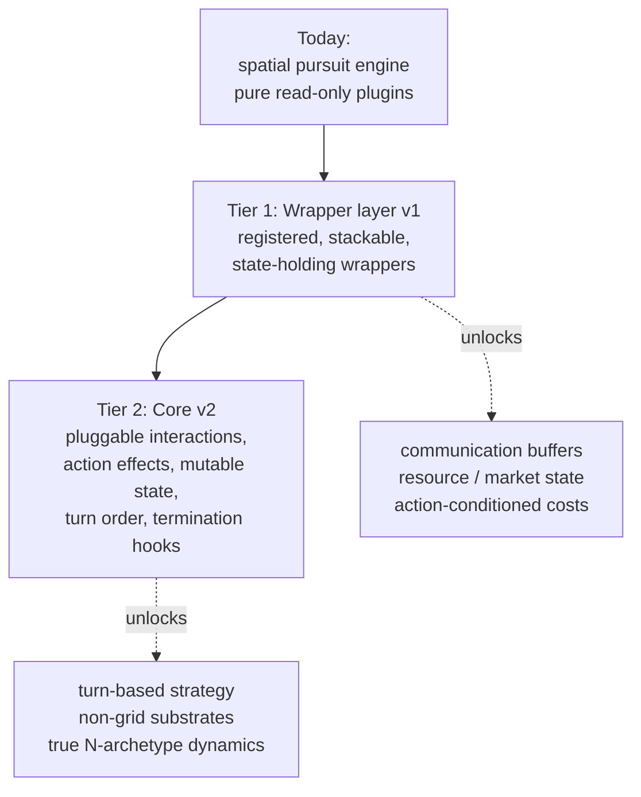

# Scope and Generalization Roadmap

This page answers a question maintainers and prospective users ask often:

> The environment is described as a testbed for cooperation *and* competition,
> with endless customization of rewards, perception, and actions, extensible to
> problems in social science, economics, and strategy. How far does the current
> architecture actually reach toward that vision, and what would it take to close
> the gap?

The honest answer has two parts, because it depends entirely on which target you
measure against.

- As a testbed for **variations on spatial pursuit with mixed cooperation and
  competition**, the project is roughly 85 to 90 percent complete. That is a real,
  scientifically useful niche, and the plugin architecture serves it well.
- As the **general "model anything in cooperation or competition" substrate** that
  spans economics, social science, and turn-based strategy, the project is closer
  to a third of the way. The remaining work is core redesign, not configuration.

The gap exists because the genuinely general-feeling part of the project (the
registry and plugin system) sits on top of a core that is specifically a
*movement-on-a-grid pursuit engine*. Several of the broader target domains need
capabilities the core does not structurally have.

This page is deliberately candid. It sets accurate expectations for users and
serves as scoping material for any publication describing the project. It
complements the [Mission](../mission.md) (the philosophy) and the
[Project Overview](index.md) (the in-scope / out-of-scope list) with a frank
assessment of reach.

---

## 1. What this environment is (and is not)

The environment is a deterministic, controlled testbed for **spatial pursuit and
evasion with configurable, mixed cooperative and competitive incentives**, built on
a plugin architecture so that perception, incentives, and learning can be swapped
independently.

It is **not** (yet) a general multi-agent simulator. Interaction happens by sharing
a cell on a bounded 2D grid; agents move; predators capture prey. Anything that
needs a different medium of interaction (messages, trades, a shared market) or a
different notion of "playing" (taking turns) currently falls outside the core.

That framing is a strength, not an apology. Controlled scope is exactly what makes
the results interpretable and reproducible, which is the project's stated priority.

---

## 2. What you can build today

Through configuration plus plugin classes alone, without touching the immutable
core, you already have a wide surface. The single assembly point is
`build_environment()` in `plug-and-play/scripts/run_from_config.py`, which wires the plugins the
core exposes.

| Dimension | What you can vary today |
|---|---|
| **Geometry / population** | Grid size, obstacle density, seed, agent counts, cell-sharing and obstacle-blocking rules, capture threshold, episode length, all via YAML |
| **Perception** | Five observation schemes (full, local-only, local-radius partial observability, absolute, egocentric relative); a new scheme returns an arbitrary per-agent feature dict and encodes to a fixed-length vector |
| **Incentives** | Stacked, weighted reward terms summed per agent; because a reward reads full state, you can express general-sum, zero-sum, or social-welfare payoffs **as long as they depend on spatial state** |
| **Actions** | Multiple movement sets (cardinal, diagonal, speed micro-stepping); a new set can define any number of movement directions |
| **Identity** | Free-form teams and sub-teams for grouping and rendering |
| **Learning** | Choice of algorithm (IQL, CQL, MixedTrainer, DQN with Double and Dueling variants, ActorCritic, A2C, A3C) and all hyperparameters |

The reward layer is the sweet spot. Mixed cooperation and competition is genuinely
first-class here: a shared team reward is cooperation, a negated opponent reward is
competition, and both can be stacked in one experiment through YAML. See the
[Rewards](../concepts/rewards.md) and [Config Recipes](../guides/config-recipes.md)
pages.

The core exposes three injection points: `reward_fn`, `observation_builder`, and
`action_space_plugin`. Note that the core class docstring names only the first two
as the sanctioned extension contract (`core/gridworld.py:49-57`);
`action_space_plugin` is consulted during `step()` but is treated as movement
geometry, not a general action channel (see the boundary below).

---

## 3. The boundaries

Each item below is a capability the broader vision needs that the current core does
not provide. Every one is rooted in the immutable core, so none can be reached by a
plugin or a config change alone.

| Vision element | What blocks it | Where |
|---|---|---|
| Non-movement actions (trade, communicate, build) | `step()` interprets an action *only* as a `[dx, dy]` position delta. Any other action becomes a move or a no-op. | `core/gridworld.py:250-276` |
| Inter-agent messaging | There is no writable per-agent channel; observations can only read positional and identity state. | no message state in core |
| Persistent economic / world state (resources, inventory, prices) | Agents carry position only. `stamina` and `agent_speed` are never read by core movement (both are overwritten from `agents.yaml` by `build_agents()`, and consumed only by `SpeedWrapper`, which reads speed for sub-step budgets and depletes stamina per sub-step). | `core/agent.py:63-72` |
| Action-conditioned payoffs (cost of trading, cost of a message) | A reward's `compute(env)` receives only the environment, never the actions taken. The base class states rewards are functions of state, not actions. | `rewards/base.py:7-10` |
| Turn-based play (chess, strategy games) | `step()` consumes a dict of all agents' actions at once and moves everyone simultaneously. Nothing tracks whose turn it is. | `core/gridworld.py:238-250` |
| More than two genuine archetypes | The dynamics collapse every agent into predator-vs-else. Capture is detected by `startswith("predator")` / `startswith("prey")`, and `_same_role` treats any non-predator as prey. | `core/gridworld.py:285-293, 334-341` |
| Custom win / termination conditions | Termination is hardcoded to a capture count or step count. There is no termination hook. | `core/gridworld.py:312-315` |

### The underlying tension

Every one of these limits traces to a single design decision: plugins are
contractually **pure and read-only**. The core docstring forbids a plugin from
modifying env state, moving agents, or changing dynamics (`core/gridworld.py:53-56`),
and the reward base class repeats the rule (`rewards/base.py:8-10`).

That purity is what guarantees reproducibility and clean ablations, which is the
whole point of the testbed. But it also means anything requiring **state that
evolves** (a message in flight, a running inventory, a market price, an alliance)
has nowhere to live. The core will not hold it, and plugins are not allowed to.
Closing the vision gap is fundamentally about deciding where evolving, shared state
is allowed to live.

---

## 4. Generalization roadmap

There are two genuinely different scopes of work, and they should not be conflated.
Tier 1 is a modest, low-risk change that respects the "do not touch core"
philosophy and unlocks a surprising amount. Tier 2 is a real core redesign.

### Tier 1: Wrapper layer v1 (low disruption, no core edit)

The single most valuable "few tweaks" change is not in the core at all. It is to
promote **wrappers** from a hidden, hard-coded step into a first-class, registered,
**stackable** layer that is explicitly allowed to hold state and to intercept `step`
and `reset`.

This pattern already exists and already works: `SpeedWrapper` (`wrappers/speed.py`)
holds stamina entirely in the wrapper, replays each logical step as sub-steps, and
rewrites the returned reward dict. It is proof that a wrapper can add evolving state
and alter observed dynamics without editing the core.

What holds it back today is only the plumbing: there is exactly one wrapper, applied
unconditionally and imported by name in `plug-and-play/scripts/run_from_config.py:28,186`, with no
registry and no way to select, order, or stack wrappers from config.

A wrapper registry plus a documented state side-channel would unlock, without
touching the immutable core:

- **Communication**: a wrapper holds a message buffer between steps and exposes it
  through the observation it forwards.
- **Resources and markets**: a wrapper maintains inventory or prices as its own
  state and folds them into rewards.
- **Action-conditioned costs**: a wrapper sees the action dict before delegating to
  `step()`, so it can charge for a trade or a message that the core reward layer
  cannot see.

This is the honest "half-step" that gets the project meaningfully closer to the
vision while staying true to its reproducibility philosophy.

### Tier 2: Core v2 (full generality)

The remaining vision elements (turn-based strategy, non-grid substrates, true
multi-archetype dynamics) cannot be faked in a wrapper. They require generalizing
the core's contract itself. This is substantial engineering, not a tweak. A v2 core
would replace the current three narrow hooks with a richer set:

1. A **pluggable interaction resolver** so "capture" becomes one instance of a
   general "what happens when agents meet or act" rule.
2. An **action-effect dispatcher** so an action can mean something other than a
   position delta.
3. **Per-agent mutable state** with an explicit, still-reproducible contract for who
   may write it.
4. A **turn-order abstraction** so simultaneous play is one option among several.
5. **Termination and role hooks** so win conditions and the number of genuine
   archetypes are configurable rather than binary and hardcoded.

Each of these is a deliberate break in the current core contract and should be
designed and versioned as such, with the reproducibility invariant preserved.

---

## 5. Note on positioning for publication

When describing the project in a paper or a Statement of Need, the accurate framing
is a **controlled, reproducible testbed for coordination and pursuit-evasion under
mixed cooperative and competitive incentives**, distinguished by determinism and
clean ablations rather than breadth. The broader social-science, economic, and
strategy applications belong in a roadmap or future-work section, not in the claimed
contribution, so reviewers see an honestly-bounded scope.

The environment's own accompanying study (arXiv:2601.17454) is evidence of use for
exactly this bounded claim: it uses the testbed to study embodiment-induced
coordination regimes, which is squarely within the spatial-pursuit niche the
architecture serves best. See [Papers and Further Reading](../reference/papers.md).
