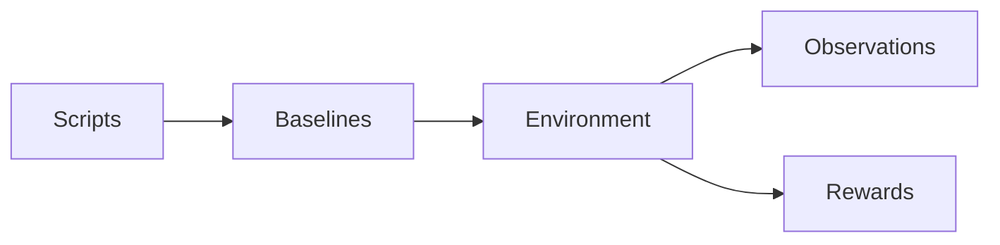
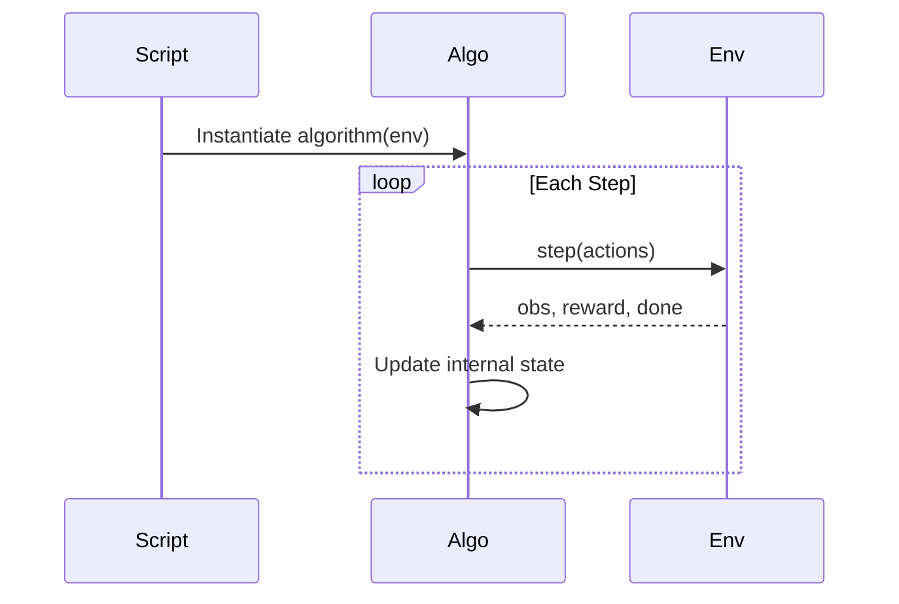

# 🧠 Baselines

### The Learning Layer

This package implements **learning algorithms** for the Predator–Prey Gridworld system.

It does **not** define:

* 🟥 Environment dynamics
* 🟧 Observations (perception)
* 🟨 Rewards (incentives)

Those belong to `ppage`.

This module implements only:

```text
Learning
```

---

# 🧭 Conceptual Position

The full system follows:

```text
Environment dynamics → Perception → Incentives → Learning
```

`baselines` implements:

```text
Learning
```

Everything before it is treated as a black box.

---

# 🏗 Structural Separation



### Rules

* Algorithms never access internal environment state
* Algorithms never compute rewards manually
* Algorithms never build observations manually
* Algorithms only consume what `env.step()` returns

---

# 🔁 Interaction Contract

Every algorithm interacts through:

```python
env.reset()
env.step(actions)
```

Execution flow:



The environment controls:

* State transitions
* Reward computation
* Observation construction

The algorithm controls:

* Action selection
* Parameter updates
* Exploration

---

# 📂 Directory Structure

```text
ppage/baselines/
│
├── base.py            # BaseAlgorithm interface
├── __init__.py        # Auto-registers IQL, CQL, MixedTrainer, DQN, ActorCritic, A2C, A3C
├── registry/          # Algorithm registry
│
├── IQL/               # Independent Q-Learning  (iql.py + CLI)
│
├── CQL/               # Centralized Q-Learning  (cql.py + CLI)
│
├── MIXED/             # MixedTrainer — per-team IQL/CQL  (mix_train.py + CLI)
│
├── DQN/               # Deep Q-Network, PyTorch (dqn.py + CLI, q_network.py, replay_buffer.py)
│
├── AC/                # One-step online Actor-Critic, PyTorch (actor_critic.py + CLI, network.py)
│
├── A2C/               # Advantage Actor-Critic (a2c.py + actor_network.py + critic_network.py)
│
├── A3C/               # Asynchronous Advantage Actor-Critic (a3c.py + shared_adam.py)
│
└── README.md
```

---

# 📜 BaseAlgorithm Contract

All algorithms must implement:

```python
select_actions(observations: dict) -> dict
train() -> None
```

Optional:

```python
evaluate(episodes: int)
```

Algorithms must:

* Operate only on observations returned by the environment
* Use rewards returned by the environment
* Respect deterministic seeding
* Avoid side effects on environment internals

---

# 📚 Included Algorithms

## 🟦 IQL — Independent Q-Learning

* One Q-table per agent
* Decentralized updates
* Epsilon-greedy exploration
* Tabular implementation

### When to Use

* Studying decentralized learning
* Partial observability experiments
* Independent policy adaptation

---

## 🟪 CQL — Centralized Q-Learning (Tabular)

* Joint state-action table shared across **all** agents in the environment
* Centralized learning signal (reward = sum of every agent's reward)
* Action selection marginalises the joint Q-tensor to get per-agent Q-values
* Suitable for small state spaces — scales as `action_dim^n_agents`

> ⚠️ **Naming collision:** this is *not* the well-known offline-RL algorithm "Conservative Q-Learning" that shares the same CQL acronym in the broader literature. This is plain online joint-action tabular Q-learning — no conservative/pessimistic regularization, no offline dataset.

### When to Use

* Coordination-heavy tasks
* Small grid sizes
* Studying centralized vs decentralized learning gaps

---

## 🟫 MixedTrainer — Per-Team Algorithm Assignment

* Predators and prey can use different algorithms (IQL or CQL)
* Configured via `predator_algo` / `prey_algo` params
* CQL teams get one joint table over *that team's* members only (not the whole env, unlike standalone CQL)
* Useful for asymmetric baselines

### When to Use

* Studying predator-prey algorithm asymmetry
* Ablations where one team is centralized, the other is not

---

## 🟩 DQN — Deep Q-Network (PyTorch)

* One independent `QNetwork` (or `DuelingQNetwork`) + target network + replay buffer per agent — architecturally like IQL, with a function approximator instead of a table
* Requires `env.observation_encoder` (a callable `encode(obs, env) -> array-like`) to already be attached — `run_from_config.build_environment()` does this automatically
* `action_dim` is inferred from `env.action_space_plugin.n_actions` and validated (raises `ValueError` on mismatch) rather than taken as a bare config default
* Optional `double_dqn: true` — decouples bootstrap action selection (online network) from evaluation (target network), reducing overestimation bias
* Optional `dueling: true` — splits the network into value `V(s)` and advantage `A(s,a)` streams, recombined as `Q(s,a) = V(s) + (A(s,a) - mean_a A(s,a))`
* Supports per-episode CSV logging via `curves_path` (reward/loss/epsilon) — the only one of the four baselines that does

### When to Use

* Function-approximation baseline instead of tabular Q-learning
* Larger observation spaces where tabular state encoding becomes impractical
* Studying Double/Dueling DQN variants against vanilla DQN

---

## 🟨 ActorCritic — One-Step Online Actor-Critic (PyTorch)

* Policy-gradient, **on-policy** — the exception among these baselines, which are
  otherwise all value-based (learn Q, act greedily)
* One independent `ActorCriticNetwork` (shared trunk, policy head + value head)
  + optimizer per agent — no replay buffer, no target network
* `select_actions` samples from `Categorical(logits=...)`; the stochastic policy
  itself is the exploration mechanism — no epsilon schedule
* Every `env.step()` immediately triggers one TD(0) gradient update
  (Sutton & Barto, *Reinforcement Learning: An Introduction*, 2nd ed., Algorithm 13.5)
* Same `env.observation_encoder` precondition and `action_dim` resolution/validation
  as DQN; same `curves_path` CSV logging support (reward/loss, no epsilon column)

### When to Use

* Studying an on-policy, directly-learned stochastic policy against DQN's
  greedy-over-Q behavior
* As the stepping stone toward the batched (A2C, below) and asynchronous (A3C,
  below) variants — see the [algorithm spec](../../docs/specs/algorithm-spec.md)
  for the full contract writeups

---

## 🟩 A2C — Advantage Actor-Critic

* One actor (policy network) + one critic (state-value network) per agent,
  separate networks rather than ActorCritic's shared trunk
* On-policy: no replay buffer -- learns directly from freshly-collected experience,
  discarding it after each update
* Learns two things at once instead of one:
  * The actor learns *what to do* (a probability distribution over actions)
  * The critic learns *how good a state is* (a baseline used to reduce variance
    in the actor's gradient, without introducing bias)
* Exploration comes from sampling the stochastic policy (plus an entropy
  bonus that discourages the policy from collapsing too early) -- there is no
  epsilon schedule

### When to Use

* Studying on-policy vs off-policy learning dynamics
* Environments/rewards where a stochastic policy is itself interesting
  (e.g. mixed-strategy pursuit-evasion)
* As the natural stepping stone toward A3C (below) and SAC
  (off-policy actor-critic with entropy maximization)

---

## 🟧 A3C — Asynchronous Advantage Actor-Critic

* Multiple worker **processes** (`torch.multiprocessing`), each stepping its own
  independent env copy — not just multiple threads, since PyTorch's GIL would
  serialize those anyway for CPU-bound work
* One shared `ActorCriticNetwork` (reused from `AC/`, not duplicated) + one
  shared `SharedAdam` optimizer per agent — workers sync a local copy, compute
  gradients locally, then push those gradients onto the shared parameters and
  step the shared optimizer with no lock ("Hogwild"-style)
* Requires `config['env_fn']` beyond every other baseline — a picklable,
  zero-argument callable that builds a fresh environment per worker; a lambda
  will not survive pickling under Windows' `'spawn'` start method
* Workers always run on CPU (not configurable) — A3C's whole premise is
  CPU-core parallelism, not GPU batching
* Same Huber critic loss as A2C; same entropy-collapse caveat (see A2C above)

### When to Use

* Studying asynchronous, multi-worker training dynamics specifically — on a
  small gridworld like this one it won't necessarily out-train A2C
  wall-clock-for-wall-clock; the interesting part is the decorrelated,
  lock-free parallel exploration itself

---

# 🔌 Algorithm Registry

Algorithms are registered by name:

```python
register("iql", IQL)
```

This enables:

* YAML-driven selection
* Swappable learning methods
* No modification to scripts

---

# 🎛 Configuration-Driven Training

Training configuration is external.

Example:

```yaml
# plug-and-play/configs/experiment_iql.yaml
experiment:
  algorithm:
    name: iql
    params:
      epsilon: 1.0
      alpha: 0.1
      gamma: 0.99
      episodes: 1000
```

Changing learning behavior requires changing configuration — not environment code.

---

# 🔁 Reproducibility Guarantees

Learning behavior is fully determined by:

* Environment seed
* Algorithm hyperparameters
* Deterministic update rules

Identical configuration → identical learning trajectory.

If two runs diverge, something is wrong.

---

# 🧩 Extension Rules

To add a new algorithm:

1. Create a new folder
2. Inherit from `BaseAlgorithm`
3. Implement required methods
4. Register it in the registry

No environment changes required.

---

# 🎯 What This Package Enables

With these baselines you can study:

* Centralized vs decentralized learning
* Coordination emergence
* Credit assignment challenges
* Reward shaping effects on convergence
* Sample efficiency comparisons

This package is intentionally:

* Simple
* Inspectable
* Tabular-first
* Education-friendly

It is not optimized for scale.

It is optimized for understanding.

---

# ▶ Running Training

From `src/`:

```bash
# Config-driven (each reads its own plug-and-play/configs/experiment_<algo>.yaml)
PYTHONPATH=src python plug-and-play/scripts/run_iql.py
PYTHONPATH=src python plug-and-play/scripts/run_cql.py
PYTHONPATH=src python plug-and-play/scripts/run_mixed.py
PYTHONPATH=src python plug-and-play/scripts/run_dqn.py
PYTHONPATH=src python plug-and-play/scripts/run_dqn.py --config-dir plug-and-play/configs/dqn_1v1   # double+dueling example
PYTHONPATH=src python plug-and-play/scripts/run_actor_critic.py
PYTHONPATH=src python plug-and-play/scripts/run_a2c.py
PYTHONPATH=src python plug-and-play/scripts/run_a3c.py

# Direct CLI (all hyperparams as flags; builds its own GridWorldEnv, bypassing run_from_config)
python -m ppage.baselines.IQL.iql --episodes 1000 --alpha 0.1 --save-path trained_iql.pkl
python -m ppage.baselines.CQL.cql --episodes 1000 --alpha 0.1 --save-path trained_cql.pkl   # NOT --cql-alpha
python -m ppage.baselines.MIXED.mix_train --predator-algo cql --prey-algo iql --episodes 1000
python -m ppage.baselines.DQN.dqn --episodes 1000 --hidden-layers 64 64 --save-path trained_dqn.pkl
python -m ppage.baselines.AC.actor_critic --episodes 1000 --hidden-layers 64 64 --save-path trained_actor_critic.pkl
python -m ppage.baselines.A2C.a2c --episodes 1000 --hidden-layers 64 64 --save-path trained_a2c.pkl
python -m ppage.baselines.A3C.a3c --episodes 1000 --hidden-layers 64 64 --num-workers 4 --save-path trained_a3c.pkl
```

---

# 🧠 Design Philosophy

This package isolates learning from environment design.

The goal is:

* Structural clarity
* Safe experimentation
* Reproducibility
* Educational transparency

Learning is modular.

Environment dynamics remain untouched.

---

# Final Summary

`baselines` implements the learning layer of the Predator–Prey Gridworld system.

It consumes observations and rewards from the environment and produces adaptive behavior.


